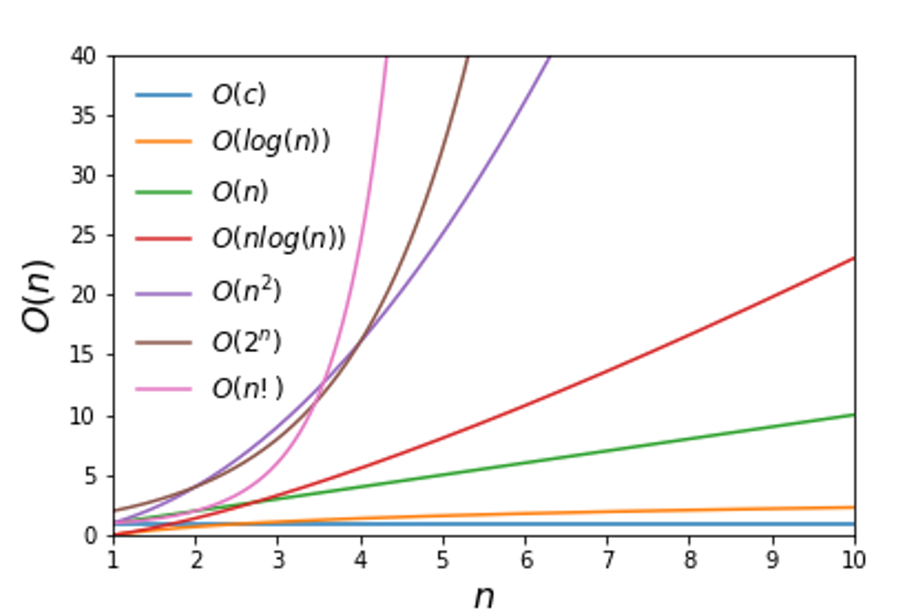

# Questions

This list is based on [Grind 169](https://www.techinterviewhandbook.org/grind75?weeks=28&hours=6&grouping=topics#)
However, it will be reset when the brower is closed, so this is the place I record the subjects I made

## Interview
Please watch [this](https://www.youtube.com/watch?v=XKu_SEDAykw&ab_channel=LifeatGoogle) video.

There are several points in the video:
1. Ask for clarification to the problem, if you don't know about the question, please feel free to ask for clarification
2. He thought out loud(自言自語) constantly is probably the best thing you can do in the interview, becauase it gives the interviewee the opportunity see your thought process and use that to crourse-correct you more towards the question. This may let you have some new idea
3. Think everything before you start coding, you might be challenged by the interviwer to think better faster or quicker
4. Test your solution in real, think about edge case
5. When we are trying to approach a problem, **we should always start from brute force solution**, even though you have been trained by solving a lot of similar problems previously

### Time complexity

## Problem List
### [Array](./array)
|  Subjects| difficulty |
| --| -- |
| - [x] [1. Two Sum](https://leetcode.com/problems/two-sum/description/), date: 2024.04.01| `easy` |
| - [x] [121. Best Time to Buy and Sell Stock](https://leetcode.com/problems/best-time-to-buy-and-sell-stock/description/), date: 2024.04.01 |  `easy` |
| - [x] [169. Majority Element](https://leetcode.com/problems/majority-element/description/), date: 2024.04.01|  `easy` |
| - [x] [217. Contains Duplicate](https://leetcode.com/problems/contains-duplicate/description/), date: 2024.04.01|  `easy` |
| - [x] [283. Move Zeroes](https://leetcode.com/problems/move-zeroes/description/), date: 2024.04.01|  `easy` |
| - [x] [977. Squares of a Sorted Array](https://leetcode.com/problems/squares-of-a-sorted-array/description/), date: 2024.04.01|  `easy` |
| - [ ] [39. Combination Sum](https://leetcode.com/problems/combination-sum/description/)| `medium` |
| - [ ] [75. Sort Colors](https://leetcode.com/problems/sort-colors/description/)| `medium` |
| - [ ] [134. Gas Station](https://leetcode.com/problems/gas-station/description/) | `medium` |
| - [ ] [128. Longest Consecutive Sequence](https://leetcode.com/problems/longest-consecutive-sequence/description/) | `medium` |
| - [x] [189. Rotate Array](https://leetcode.com/problems/rotate-array/description/), **fail** | `medium` |
| - [x] [525. Contiguous Array](https://leetcode.com/problems/contiguous-array/description/) | `medium` |

### Two Pointer
- [ ] [15. 3Sum](https://leetcode.com/problems/3sum/description/)
- [ ] [16. 3Sum Closest](https://leetcode.com/problems/3sum-closest/description/)
- [ ] [228. Summary Ranges](https://leetcode.com/problems/summary-ranges/description/)
- [ ] [495. Teemo Attacking](https://leetcode.com/problems/teemo-attacking/description/)
- [ ] [986. Interval List Intersections](https://leetcode.com/problems/interval-list-intersections/description/)

### Sliding Window
> This type of subject are fixed
- [ ] [30. Substring with Concatenation of All Words](https://leetcode.com/problems/substring-with-concatenation-of-all-words/description/)
- [x] [76. Minimum Window Substring](https://leetcode.com/problems/minimum-window-substring/description/), **example**
- [ ] [187. Repeated DNA Sequences](https://leetcode.com/problems/repeated-dna-sequences/description/)
- [ ] [239. Sliding Window Maximum](https://leetcode.com/problems/sliding-window-maximum/)
- [x] [567. Permutation in String](https://leetcode.com/problems/permutation-in-string/description/)

### Prefix Sum
- [x] [238. Product of Array Except Self](https://leetcode.com/problems/product-of-array-except-self/description/), "prefix sum", **fail**
- [x] [560. Subarray Sum Equals K](https://leetcode.com/problems/subarray-sum-equals-k/description/)
- [x] [1343. Number of Sub-arrays of Size K and Average Greater than or Equal to Threshold](https://leetcode.com/problems/number-of-sub-arrays-of-size-k-and-average-greater-than-or-equal-to-threshold/description/), can also use two pointers
- [x] [974. Subarray Sums Divisible by K](https://leetcode.com/problems/subarray-sums-divisible-by-k/)
- [x] [1010. Pairs of Songs With Total Durations Divisible by 60](https://leetcode.com/problems/pairs-of-songs-with-total-durations-divisible-by-60/description/)
- [ ] [209. Minimum Size Subarray Sum](https://leetcode.com/problems/minimum-size-subarray-sum/description/)
- [ ] [304. Range Sum Query 2D - Immutable](https://leetcode.com/problems/range-sum-query-2d-immutable/description/)
- [ ] [363. Max Sum of Rectangle No Larger Than K](https://leetcode.com/problems/max-sum-of-rectangle-no-larger-than-k/description/)

### [Binary Search](./array/binary_search/README.md)
- [x] [704. Binary Search](https://leetcode.com/problems/binary-search/description/)
- [x] [875. Koko Eating Bananas](https://leetcode.com/problems/koko-eating-bananas/description/), **fail**
- [x] [278. First Bad Version](https://leetcode.com/problems/first-bad-version/description/) 
- [x] [33. Search in Rotated Sorted Array](https://leetcode.com/problems/search-in-rotated-sorted-array/description/)
- [x] [34. Find First and Last Position of Element in Sorted Array](https://leetcode.com/problems/find-first-and-last-position-of-element-in-sorted-array/description/)
- [x] [981. Time Based Key-Value Store](https://leetcode.com/problems/time-based-key-value-store/description/)
- [x] [74. Search a 2D Matrix](https://leetcode.com/problems/search-a-2d-matrix/description/)
- [x] [1011. Capacity To Ship Packages Within D Days](https://leetcode.com/problems/capacity-to-ship-packages-within-d-days/description/)
- [x] [153. Find Minimum in Rotated Sorted Array](https://leetcode.com/problems/find-minimum-in-rotated-sorted-array/description/)
- [ ] [1235. Maximum Profit in Job Scheduling](https://leetcode.com/problems/maximum-profit-in-job-scheduling/description/)
- [ ] [4. Median of Two Sorted Arrays](https://leetcode.com/problems/median-of-two-sorted-arrays/description/)

### [Greedy Algorithm](./greedy/README.md)
- [x] [11. Container With Most Water](https://leetcode.com/problems/container-with-most-water/description/)
- [x] [45. Jump Game II](https://leetcode.com/problems/jump-game-ii/description/)
- [x] [55. Jump Game](https://leetcode.com/problems/jump-game/description/)
- [x] [56. Merge Intervals](https://leetcode.com/problems/merge-intervals/description/)
- [x] [57. Insert Interval](https://leetcode.com/problems/insert-interval/description/), **fail**
- [x] [122. Best Time to Buy and Sell Stock II](https://leetcode.com/problems/best-time-to-buy-and-sell-stock-ii/description/)
- [x] [435. Non-overlapping Intervals](https://leetcode.com/problems/non-overlapping-intervals/description/)
- [x] [452. Minimum Number of Arrows to Burst Balloons](https://leetcode.com/problems/minimum-number-of-arrows-to-burst-balloons/description/)
- [x] [763. Partition Labels](https://leetcode.com/problems/partition-labels/description/)
- [x] [330. Patching Array](https://leetcode.com/problems/patching-array/description/), **fail**, similar 1798
- [x] [1024. Video Stitching](https://leetcode.com/problems/video-stitching/description/)
- [ ] [1326. Minimum Number of Taps to Open to Water a Garden](https://leetcode.com/problems/minimum-number-of-taps-to-open-to-water-a-garden/description/)
- [x] [1353. Maximum Number of Events That Can Be Attended](https://leetcode.com/problems/maximum-number-of-events-that-can-be-attended/description/), **fail**, priority queue
- [ ] [1520. Maximum Number of Non-Overlapping Substrings](https://leetcode.com/problems/maximum-number-of-non-overlapping-substrings/description/)
- [ ] [1798. Maximum Number of Consecutive Values You Can Make](https://leetcode.com/problems/maximum-number-of-consecutive-values-you-can-make/description/)

### Dynamic Programming
- [ ] [70. Climbing Stairs](https://leetcode.com/problems/climbing-stairs/description/)
- [ ] [53. Maximum Subarray](https://leetcode.com/problems/maximum-subarray/description/) 
- [ ] [322. Coin Change](https://leetcode.com/problems/coin-change/description/)
- [ ] [416. Partition Equal Subset Sum](https://leetcode.com/problems/partition-equal-subset-sum/description/)
- [ ] [62. Unique Paths](https://leetcode.com/problems/unique-paths/description/)
- [ ] [198. House Robber](https://leetcode.com/problems/house-robber/description/)
- [ ] [152. Maximum Product Subarray](https://leetcode.com/problems/maximum-product-subarray/description/)
- [ ] [300. Longest Increasing Subsequence](https://leetcode.com/problems/longest-increasing-subsequence/description/)
- [ ] [309. Best Time to Buy and Sell Stock with Cooldown](https://leetcode.com/problems/best-time-to-buy-and-sell-stock-with-cooldown/description/)
- [ ] [221. Maximal Square](https://leetcode.com/problems/maximal-square/description/)
- [ ] [91. Decode Ways](https://leetcode.com/problems/decode-ways/description/)
- [ ] [377. Combination Sum IV](https://leetcode.com/problems/combination-sum-iv/description/)
- [ ] [309. Best Time to Buy and Sell Stock with Cooldown](https://leetcode.com/problems/best-time-to-buy-and-sell-stock-with-cooldown/description/)

### String
- [ ] [125. Valid Palindrome](https://leetcode.com/problems/valid-palindrome/description/)
- [ ] [242. Valid Anagram](https://leetcode.com/problems/valid-anagram/description/) 
- [ ] [409. Longest Palindrome](https://leetcode.com/problems/longest-palindrome/description/)
- [ ] [14. Longest Common Prefix](https://leetcode.com/problems/longest-common-prefix/description/)
- [x] [3. Longest Substring Without Repeating Characters](https://leetcode.com/problems/longest-substring-without-repeating-characters/description/)
- [ ] [8. String to Integer (atoi)](https://leetcode.com/problems/string-to-integer-atoi/description/)
- [ ] [5. Longest Palindromic Substring](https://leetcode.com/problems/longest-palindromic-substring/description/)
- [ ] [438. Find All Anagrams in a String](https://leetcode.com/problems/find-all-anagrams-in-a-string/description/)
- [ ] [49. Group Anagrams](https://leetcode.com/problems/group-anagrams/description/)
- [ ] [424. Longest Repeating Character Replacement](https://leetcode.com/problems/longest-repeating-character-replacement/description/)

### Stack
- [ ] [20. Valid Parentheses](https://leetcode.com/problems/valid-parentheses/description/)
- [ ] [232. Implement Queue using Stacks](https://leetcode.com/problems/implement-queue-using-stacks/description/) 
- [ ] [844. Backspace String Compare](https://leetcode.com/problems/backspace-string-compare/description/)
- [ ] [150. Evaluate Reverse Polish Notation](https://leetcode.com/problems/evaluate-reverse-polish-notation/description/)
- [ ] [155. Min Stack](https://leetcode.com/problems/min-stack/description/)
- [ ] [739. Daily Temperatures](https://leetcode.com/problems/daily-temperatures/description/)
- [ ] [394. Decode String](https://leetcode.com/problems/decode-string/description/)
- [ ] [735. Asteroid Collision](https://leetcode.com/problems/asteroid-collision/description/)
- [ ] [227. Basic Calculator II](https://leetcode.com/problems/basic-calculator-ii/description/)
- [ ] [42. Trapping Rain Water](https://leetcode.com/problems/trapping-rain-water/description/)
- [ ] [224. Basic Calculator](https://leetcode.com/problems/basic-calculator/description/)
- [ ] [84. Largest Rectangle in Histogram](https://leetcode.com/problems/largest-rectangle-in-histogram/description/) 
- [ ] [895. Maximum Frequency Stack](https://leetcode.com/problems/maximum-frequency-stack/description/)
- [ ] [32. Longest Valid Parentheses](https://leetcode.com/problems/longest-valid-parentheses/description/)

### Hash Table
- [x] [383. Ransom Note](https://leetcode.com/problems/ransom-note/description/)
- [x] [380. Insert Delete GetRandom O(1)](https://leetcode.com/problems/insert-delete-getrandom-o1/description/) 
- [x] [41. First Missing Positive](https://leetcode.com/problems/first-missing-positive/description/)

### Linked List
- [x] [21. Merge Two Sorted Lists](https://leetcode.com/problems/merge-two-sorted-lists/description/)
- [x] [141. Linked List Cycle](https://leetcode.com/problems/linked-list-cycle/description/)
- [x] [142. Linked List Cycle II](https://leetcode.com/problems/linked-list-cycle-ii/description/)
- [x] [206. Reverse Linked List](https://leetcode.com/problems/reverse-linked-list/description/)
- [x] [876. Middle of the Linked List](https://leetcode.com/problems/middle-of-the-linked-list/description/)
- [x] [234. Palindrome Linked List](https://leetcode.com/problems/palindrome-linked-list/description/)
- [ ] [146. LRU Cache](https://leetcode.com/problems/lru-cache/description/)
- [ ] [19. Remove Nth Node From End of List](https://leetcode.com/problems/remove-nth-node-from-end-of-list/description/)
- [x] [24. Swap Nodes in Pairs](https://leetcode.com/problems/swap-nodes-in-pairs/description/)
- [ ] [328. Odd Even Linked List](https://leetcode.com/problems/odd-even-linked-list/description/)
- [ ] [2. Add Two Numbers](https://leetcode.com/problems/add-two-numbers/description/)
- [x] [148. Sort List](https://leetcode.com/problems/sort-list/description/), **fail**, practice merge sort
- [x] [143. Reorder List](https://leetcode.com/problems/reorder-list/description/) 
- [x] [61. Rotate List](https://leetcode.com/problems/rotate-list/description/)
- [ ] [25. Reverse Nodes in k-Group](https://leetcode.com/problems/reverse-nodes-in-k-group/description/)
- [x] [2095. Delete the Middle Node of a Linked List](https://leetcode.com/problems/delete-the-middle-node-of-a-linked-list/description/)

### Binary Tree
- [x] [226. Invert Binary Tree](https://leetcode.com/problems/invert-binary-tree/description/)
- [x] [110. Balanced Binary Tree](https://leetcode.com/problems/balanced-binary-tree/description/), **fail**
- [x] [543. Diameter of Binary Tree](https://leetcode.com/problems/diameter-of-binary-tree/description/)
- [x] [104. Maximum Depth of Binary Tree](https://leetcode.com/problems/maximum-depth-of-binary-tree/description/)
- [x] [100. Same Tree](https://leetcode.com/problems/same-tree/description/)
- [x] [101. Symmetric Tree](https://leetcode.com/problems/symmetric-tree/description/)
- [x] [572. Subtree of Another Tree](https://leetcode.com/problems/subtree-of-another-tree/description/)
- [ ] [102. Binary Tree Level Order Traversal](https://leetcode.com/problems/binary-tree-level-order-traversal/description/)
- [ ] [236. Lowest Common Ancestor of a Binary Tree](https://leetcode.com/problems/lowest-common-ancestor-of-a-binary-tree/description/)
- [ ] [199. Binary Tree Right Side View](https://leetcode.com/problems/binary-tree-right-side-view/description/)
- [ ] [105. Construct Binary Tree from Preorder and Inorder Traversal](https://leetcode.com/problems/construct-binary-tree-from-preorder-and-inorder-traversal/description/)
- [ ] [113. Path Sum II](https://leetcode.com/problems/path-sum-ii/description/)
- [ ] [662. Maximum Width of Binary Tree](https://leetcode.com/problems/maximum-width-of-binary-tree/description/)
- [ ] [103. Binary Tree Zigzag Level Order Traversal](https://leetcode.com/problems/binary-tree-zigzag-level-order-traversal/description/)
- [ ] [863. All Nodes Distance K in Binary Tree](https://leetcode.com/problems/all-nodes-distance-k-in-binary-tree/description/)
- [ ] [297. Serialize and Deserialize Binary Tree](https://leetcode.com/problems/serialize-and-deserialize-binary-tree/description/)
- [ ] [124. Binary Tree Maximum Path Sum](https://leetcode.com/problems/binary-tree-maximum-path-sum/description/)

### Binary Search Tree
- [ ] [235. Lowest Common Ancestor of a Binary Search Tree](https://leetcode.com/problems/lowest-common-ancestor-of-a-binary-search-tree/description/)
- [ ] [108. Convert Sorted Array to Binary Search Tree](https://leetcode.com/problems/convert-sorted-array-to-binary-search-tree/description/) 
- [ ] [98. Validate Binary Search Tree](https://leetcode.com/problems/validate-binary-search-tree/description/)
- [ ] [230. Kth Smallest Element in a BST](https://leetcode.com/problems/kth-smallest-element-in-a-bst/description/)

### Graph
- [ ] [733. Flood Fill](https://leetcode.com/problems/flood-fill/description/)
- [ ] [542. 01 Matrix](https://leetcode.com/problems/01-matrix/description/) 
- [ ] [133. Clone Graph](https://leetcode.com/problems/clone-graph/description/)
- [ ] [207. Course Schedule](https://leetcode.com/problems/course-schedule/description/)
- [ ] [200. Number of Islands](https://leetcode.com/problems/number-of-islands/description/)
- [ ] [994. Rotting Oranges](https://leetcode.com/problems/rotting-oranges/description/)
- [ ] [721. Accounts Merge](https://leetcode.com/problems/accounts-merge/description/)
- [ ] [79. Word Search](https://leetcode.com/problems/word-search/description/)
- [ ] [310. Minimum Height Trees](https://leetcode.com/problems/minimum-height-trees/description/)
- [ ] [417. Pacific Atlantic Water Flow](https://leetcode.com/problems/pacific-atlantic-water-flow/description/)
- [ ] [210. Course Schedule II](https://leetcode.com/problems/course-schedule-ii/description/) 
- [ ] [787. Cheapest Flights Within K Stops](https://leetcode.com/problems/cheapest-flights-within-k-stops/description/)
- [ ] [127. Word Ladder](https://leetcode.com/problems/word-ladder/description/)
- [ ] [329. Longest Increasing Path in a Matrix](https://leetcode.com/problems/longest-increasing-path-in-a-matrix/description/)
- [ ] [212. Word Search II](https://leetcode.com/problems/word-search-ii/description/)
- [ ] [815. Bus Routes](https://leetcode.com/problems/bus-routes/description/)

### Trie
- [ ] [208. Implement Trie (Prefix Tree)](https://leetcode.com/problems/implement-trie-prefix-tree/description/)
- [ ] [139. Word Break](https://leetcode.com/problems/word-break/description/) 
- [ ] [211. Design Add and Search Words Data Structure](https://leetcode.com/problems/design-add-and-search-words-data-structure/description/)

### Heap
- [ ] [973. K Closest Points to Origin](https://leetcode.com/problems/k-closest-points-to-origin/description/)
- [ ] [621. Task Scheduler](https://leetcode.com/problems/task-scheduler/description/) 
- [ ] [692. Top K Frequent Words](https://leetcode.com/problems/top-k-frequent-words/description/)
- [ ] [658. Find K Closest Elements](https://leetcode.com/problems/find-k-closest-elements/description/)
- [ ] [215. Kth Largest Element in an Array](https://leetcode.com/problems/kth-largest-element-in-an-array/description/)
- [ ] [295. Find Median from Data Stream](https://leetcode.com/problems/find-median-from-data-stream/description/)
- [ ] [23. Merge k Sorted Lists](https://leetcode.com/problems/smallest-range-covering-elements-from-k-lists/description/)
- [ ] [632. Smallest Range Covering Elements from K Lists](https://leetcode.com/problems/smallest-range-covering-elements-from-k-lists/description/)

### Recursion
- [ ] [46. Permutations](https://leetcode.com/problems/permutations/description/)
- [ ] [78. Subsets](https://leetcode.com/problems/subsets/description/) 
- [ ] [17. Letter Combinations of a Phone Number](https://leetcode.com/problems/letter-combinations-of-a-phone-number/description/)
- [ ] [31. Next Permutation](https://leetcode.com/problems/next-permutation/description/)
- [ ] [22. Generate Parentheses](https://leetcode.com/problems/generate-parentheses/description/)
- [ ] [51. N-Queens](https://leetcode.com/problems/n-queens/description/)

### Matrix 
- [ ] [54. Spiral Matrix](https://leetcode.com/problems/spiral-matrix/description/)
- [ ] [36. Valid Sudoku](https://leetcode.com/problems/valid-sudoku/description/) 
- [ ] [48. Rotate Image](https://leetcode.com/problems/rotate-image/description/)
- [ ] [73. Set Matrix Zeroes](https://leetcode.com/problems/set-matrix-zeroes/description/)
- [ ] [37. Sudoku Solver](https://leetcode.com/problems/sudoku-solver/description/)

### Backtracking
- [ ] [91. Decode Ways](https://leetcode.com/problems/decode-ways/description/)
- [ ] [282. Expression Add Operators](https://leetcode.com/problems/expression-add-operators/description/)

### Binary
- [ ] [67. Add Binary](https://leetcode.com/problems/add-binary/description/)
- [ ] [338. Counting Bits](https://leetcode.com/problems/counting-bits/description/) 
- [ ] [191. Number of 1 Bits](https://leetcode.com/problems/number-of-1-bits/description/)
- [ ] [136. Single Number](https://leetcode.com/problems/single-number/description/)
- [ ] [268. Missing Number](https://leetcode.com/problems/missing-number/description/)
- [ ] [190. Reverse Bits](https://leetcode.com/problems/reverse-bits/description/)
- [ ] [287. Find the Duplicate Number](https://leetcode.com/problems/find-the-duplicate-number/description/)

### Math
- [ ] [13. Roman to Integer](https://leetcode.com/problems/roman-to-integer/description/)
- [ ] [9. Palindrome Number](https://leetcode.com/problems/palindrome-number/description/) 
- [ ] [528. Random Pick with Weight](https://leetcode.com/problems/random-pick-with-weight/description/)
- [ ] [50. Pow(x, n)](https://leetcode.com/problems/powx-n/description/)
- [ ] [7. Reverse Integer](https://leetcode.com/problems/reverse-integer/description/)

### Multi-thread
- [ ] [1915. Number of Wonderful Substrings](https://leetcode.com/problems/number-of-wonderful-substrings/description/)