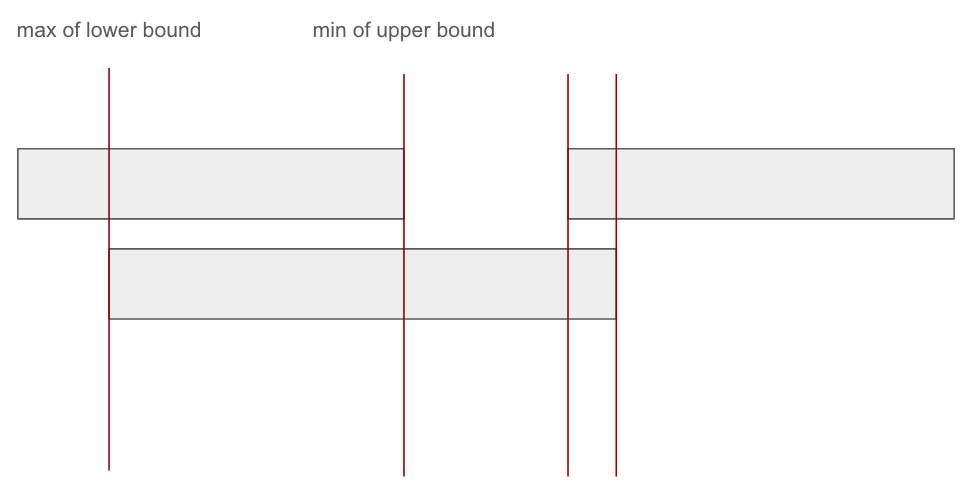

# 986. Interval List Intersections

```c++
class Solution {
public:
    vector<vector<int>> intervalIntersection(vector<vector<int>>& firstList, vector<vector<int>>& secondList) {
        int n = firstList.size(), m = secondList.size(), i = 0, j = 0;
        vector<vector<int>> ans;

        while(i < n && j < m) {
            if (secondList[j][0] > firstList[i][1]) {
                i++;
            }
            else if (firstList[i][0] > secondList[j][1]) {
                j++;
            } else if(secondList[j][0] <= firstList[i][1] && 
               secondList[j][0] >= firstList[i][0]) {
                if(secondList[j][1] > firstList[i][1]) {
                    ans.push_back({secondList[j][0], firstList[i][1]});
                    i++;
                }
                else if(secondList[j][1] < firstList[i][1]) {
                    ans.push_back({secondList[j][0], secondList[j][1]});
                    j++;
                }
                else if(secondList[j][1] == firstList[i][1]) {
                    ans.push_back({secondList[j][0], secondList[j][1]});
                    i++, j++;
                }
            }
            else if(secondList[j][1] >= firstList[i][0] && 
               secondList[j][0] <= firstList[i][0]) {
                if(secondList[j][1] < firstList[i][1]) {
                    ans.push_back({firstList[i][0], secondList[j][1]});
                    j++;
                }
                else if(secondList[j][1] > firstList[i][1]) {
                    ans.push_back({firstList[i][0], firstList[i][1]});
                    i++;
                }
                else if(secondList[j][1] == firstList[i][1]) {
                    ans.push_back({firstList[i][0], firstList[i][1]});
                    j++, i++;
                }
            }
        }

        return ans;
    }
};
```

We can simplified the logic



and the overlap interval can be like:

```c++
else {
    int left = max(firstList[i][0], secondList[j][0]);
    int right = min(firstList[i][1], secondList[j][1]);

    ans.push_back({left, right});

    if(firstList[i][1] < secondList[j][1])
        i++;
    else
        j++;
}
```

this is remarkable simplified and readable.