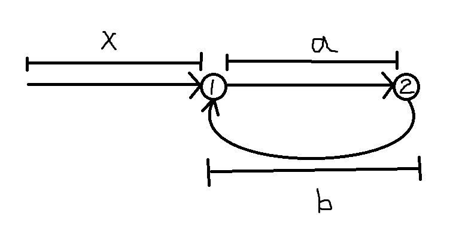

# Array 的解題框架

陣列通常會遇到下面幾種出題方法：
1. 區間問題：這個需要配合動態規劃、貪婪演算法處理，比較棘手 (Medium to hard)
2. 雙指標問題：像是二元搜尋法、移動窗口和快慢指標等等
3. 前綴和(prefix sum): 這個等等也有框架說明

## Prefix Sum 技巧使用
參考: [prefix sum](https://blog.csdn.net/ch_609583349/article/details/106423315)

可以先把框架打出來：
```

```

當題目中出現**子陣列的和、連續子陣列、除了自己以外的其他所有元素**等等的關鍵字可能就是用這個框架
subarray, continuous subaarray etc.

例題一：[560. Subarray Sum Equals K](https://leetcode.com/problems/subarray-sum-equals-k/description/)
Please watch the tutorial video: [TUTORIAL](https://www.youtube.com/watch?v=2ifoG7ZIz4Q&ab_channel=%E8%B4%BE%E8%80%83%E5%8D%9A)

brute force
```c++
class Solution {
public:
    int subarraySum(vector<int>& nums, int k) {
        
        int count = 0, n = nums.size();

        for(int i = 0; i < n; i++) {
            int sum = 0;
            for(int j = i; j < n; j++) {
                sum += nums[j];
                if(sum == k) {
                    count++;
                }
            }
        }

        return count;
    }
};
```

We can use a vector to memorize the sum of the postfix,
Use **hashmap**

98%, time complexity: O(2n) 
40%, memory, space complexity: O(2n)
```c++
class Solution {
public:
    int subarraySum(vector<int>& nums, int k) {
        int count = 0;
        int n = nums.size();
        vector<int> sum(n + 1, 0);
        unordered_map<int, int> map;

        for(int i = 1; i <= n; i++) 
            sum[i] = sum[i - 1] + nums[i - 1];

        for(int i = 0; i <= n; i++) {
            if(map.find(sum[i] - k) != map.end())
                count += map[sum[i] - k];
            map[sum[i]] += 1;
        }

        return count;
    }
};
```

當然，程式碼還可以更加優化：
```c++
class Solution {
public:
    int subarraySum(vector<int>& nums, int k) {
        int count = 0;
        int n = nums.size();
        int sum = 0;
        unordered_map<int, int> map;
        map[sum] += 1;

        for(int i = 0; i < n; i++) {
            sum += nums[i];

            if(map.find(sum - k) != map.end())
                count += map[sum - k];
            map[sum] += 1;
        }

        return count;
    }
};
```

similarity, 1343. Number of Sub-arrays of Size K and Average Greater than or Equal to Threshold

we can use prefix sum:
```c++
class Solution {
public:
    int numOfSubarrays(vector<int>& arr, int k, int threshold) {
        int n = arr.size();
        threshold *= k;
        int count = 0;
        int sum = 0;

        for(int i = 0; i < k; i++)
            sum += arr[i];

        if(sum >= threshold)
            count++;

        for(int i = k; i < n; i++) {
            sum += arr[i] - arr[i-k];
            if(sum >= threshold)
                count++;
        }
            
        return count;
    }
};
```

Leetcode 1010
```C
/*
Logic -
Whenever we consider any number time[i] we can have 2 possibilities :

1) Number is divisible by 60.
2) Number is not divisible by 60.

We basically need to consider the time[i]%60 each time to know if it is==0 or not.
1) If modulo_val==0 we simply do count+=hash[modulo_val]
2) Else we need to find out how far is time[i] away from its next 60 multiple i.e 100 is 20 far from 120 which is a multiple of 60 so if we have a 20 alreay existing then (100,20) can make a valid pair.
3) To achieve this we first do time[i]%60 then subtract it from 60. Like 100 % 60=40 and 60-40=20. So count+=hash[20]

*/
```

Leetcode 209 

注意 greater or equal than

Prefix sum:
```c++
class Solution {
public:
    int minSubArrayLen(int target, vector<int>& nums) {
        int n = nums.size();
        int sum = 0, ans = INT_MAX;
        map<int, int> map;

        map[0] = -1;

        for (int i = 0; i < n; i++) {
            sum += nums[i];
            
            
            if (map.find(sum - target) != map.end()) {
                ans = min(ans, i - map[sum - target]);
            }
            else {
                auto it = map.lower_bound(sum - target);
                if (it != map.begin()) {
                    --it;
                    ans = min(ans, i - it->second);
                }
            }
            
            map[sum] = i;
        }

        return ans == INT_MAX ? 0 : ans;
    }
};
```

可以用 sliding window 進行加速
```c++

```

## 雙指標框架
### 介紹
雙指標分為兩種：快慢指標和左右指標。前者主要解決鏈結串列的問題，後者主要解決陣列和字串的問題。

### 快慢指標
> 一個走一步，一個走兩步

1. 判斷鏈結串列是否有環
    - e.g. [141. Linked List Cycle](https://leetcode.com/problems/linked-list-cycle/description/) 
2. 已經知道鏈結串列有環，返回這個環的起始位置，**fail**，數學題
    - e.g. [142. Linked List Cycle II](https://leetcode.com/problems/linked-list-cycle-ii/description/)
    
    假設 1 是環狀起點，2 是相遇的點，慢指標會走 $x + a$ 步、快指標會走 $x + 2 * a + b$ 步，又快指標走的距離是慢指標的兩倍，可以列出下列方程式
    $$
    2(x+a) = x + 2a+b
    $$
    $$
    2x+2a = x + 2a + b
    $$
    $$
    x = b
    $$

    因此當指標相遇之後，可以把 `slow = head`，之後 `fast` 和 `slow` 一起走直到相遇。

    ```c++
    /**
     * Definition for singly-linked list.
     * struct ListNode {
     *     int val;
     *     ListNode *next;
     *     ListNode(int x) : val(x), next(NULL) {}
     * };
     */
    class Solution {
    public:
        ListNode *detectCycle(ListNode *head) {
            ListNode *slow = head, *fast = head;
            while(fast && fast->next) {
                slow = slow->next;
                fast = fast->next->next;
                if(slow == fast)
                    break;
            }

            if(fast == nullptr || fast->next == nullptr)
                return nullptr;
            
            slow = head;

            while(slow != fast) {
                slow = slow->next;
                fast = fast->next;
            }
            return slow;
        }
    };`
    ```

3. 尋找單向的鏈結串列的中點
    - e.g. [21. Merge Two Sorted Lists](https://leetcode.com/problems/merge-two-sorted-lists/description/)


### 左右指標
1. [二元搜尋法](./binary_search/README.md)
2. 兩數之和
3. 反轉陣列
4. 滑動視窗演算法

