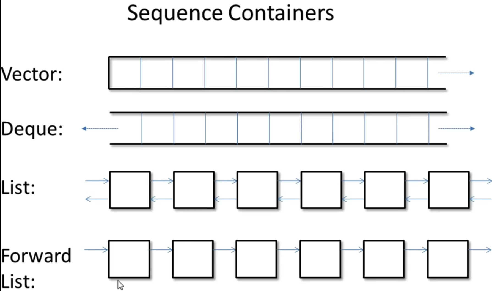
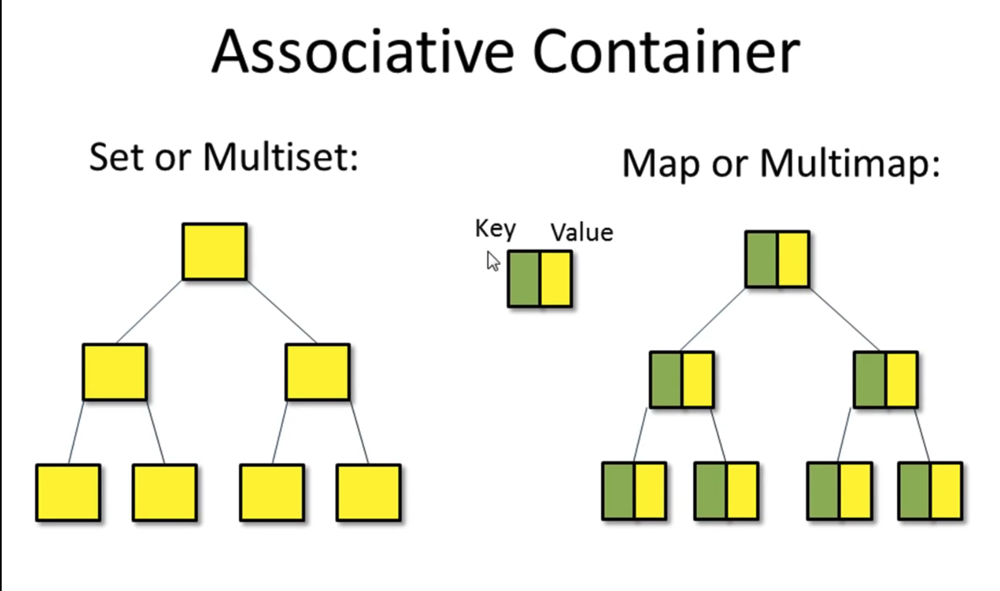
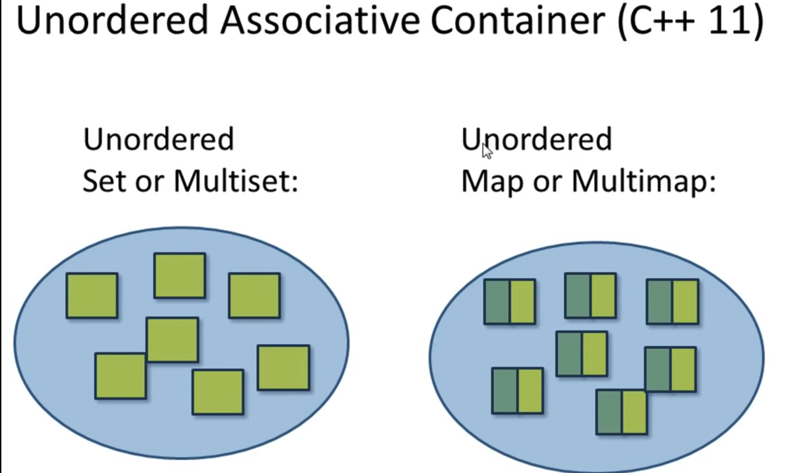
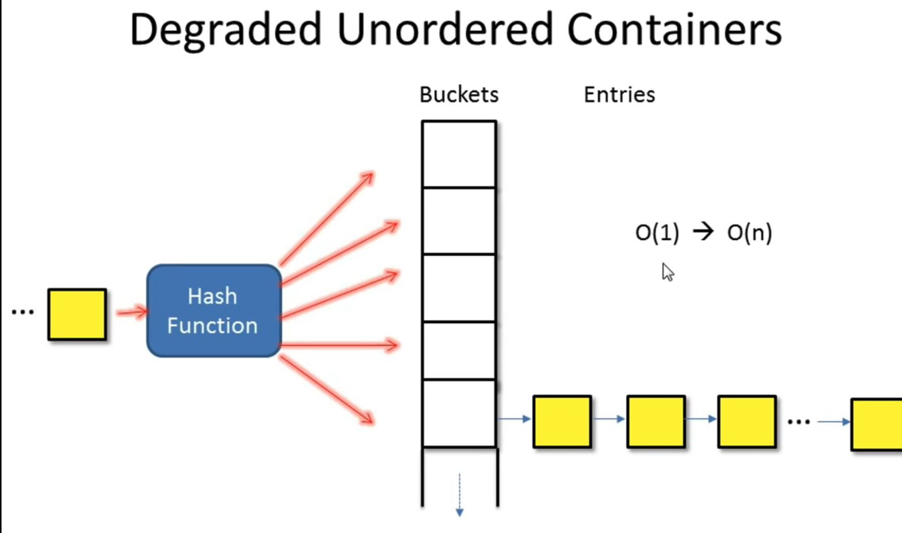

# Basic C++ skill

There are three components in C++ STL:
1. Container
2. Iterator
3. ALgorithm

> Notice: each of them has common functions

There are some reasons to use C++ standard library:
1. code reuse, no need to re-invent the wheel
2. efficiency. modern c++ compiler are usually tuned to optimize for c++ standard library code
3. accurate, less buggy
4. Terse, readable code, reduce control flow
5. standardization, guarenteed availibility
6. A role model of writing library
7. Good knowledge of data structures and algorithms

## Introduction
### Template


### Containers
- Sequence containers (array or linker list)
    - vector, deque, list, forward list, array
- Associative containers (binary tree), **which is always sorted**
    - set, multiset
    - map, multimap
- Unordered Containers(hash table)
    - unordered set/multiset
    - unordered map/multimap

Let's see the header file
```c++
#include <vector>
#include <deque>
#include <list>
#include <set>
#include <map>
#include <unordered_set>
#include <unordered_map>

#include <iterator>
#include <algorithm>

#include <numeric>
#include <functional>
```

## Sequential Containers

### vector
Please refer to [vector api](https://cplusplus.com/reference/vector/vector/)

```c++
#include <iostream>
#include <vector>
#include <algorithm>

using namespace std;

int main()
{
    vector<int> num; // at this time, num.size() is 0

    if(num.empty())  //common api to check the container is empty
        cout << "empty container" << endl;
    
    num.push_back(4);
    num.push_back(1);
    num.push_back(8); // at this time, num: {4, 1, 8}
                      // at this time, num.size() is 3

    cout << num[2] << endl;    // 8, no range check
    cout << num.at(2) << endl; // 8, throw range_error exception of out of range

    // vector is a dynamically allocated contiguous array in memory
    // you can use a pointer like using an array
    int *p = &num[0];  
    
    vector<int>::iterator start = num.begin();
    vector<int>::iterator end = num.end();
    
    for(vector<int>::iterator itr = start; itr != end; itr++)
        cout << *itr << " ";
    cout << endl;
    
    // sorting vector
    sort(start, end);
    
    for(vector<int>::iterator itr = start; itr != end; itr++)
        cout << *itr << " ";
    cout << endl;

    vector<int> copy(num); // copy the constructor, copy: {1, 4, 8}
    num.clear(); // remove all num element
    copy.swap(num); // swap all element to num
    for(vector<int>::iterator itr = start; itr != end; itr++)
        cout << *itr << " ";
    cout << endl;
    
    cout << "print copy" << endl;
    for(vector<int>::iterator itr = copy.begin(); itr != copy.end(); itr++)
        cout << *itr << " ";
    cout << endl;

    return 0;
}
```

> Notice: `num.end()` dodes not exist, it is null pointer, thus, do not print that

Properties of vector:
1. Fast insert/remove at the end: `O(1)`
2. Slow insert/ remove at the beginning or in the middle: `O(n)`
3. slow search: `O(n)`

### deque (雙向佇列)
Different with vector, vector can only `push_back` and `pop_back` at O(1), and deque and `push_front` and `push_back`

like this:
```c++
deque<int> deq = {2, 3, 4};
deq.push_front(1);
deq.push_back(5);

cout << deq[1];
```

Properties:
1. fast insert/remove at the beginning and the end
2. slow insert/remove in the middle
3. slow search

### list (鏈結串列)

the implementation in C++ is doubly linked list
You can refer to the [list api](https://cplusplus.com/reference/list/list/)

```c++
list<int> l = {5, 2, 9};
l.push_back(6);  // l: {5, 2, 9, 6}
l.push_front(3); // l: {3, 5, 2, 9, 6}

list<int>::iterator itr = find(l.begin(), l.end(), 2); // itr -> 2

// The container is extended by inserting new elements before the element at the specified position.
l.insert(itr, 8); // {3, 5, 8, 2, 9, 6}

itr++;            // itr -> 9
l.erase(itr);     // l: {3, 5, 8, 2, 6}

list<int> l2;
l.splice(itr, l2, itr_a, itr_b); // move the elements to another list
                                 // O(1)
```

Properties:
1. fast insert/remove at any place: `O(1)`
2. slow search: `O(n)`
3. no random access, no [] operator

### forward list
It is a single direction of linked list, you can traverse from the head to the tail, but cannot traverse from tail to head

### array
The type include `<type, size>`, so `array<int, 3>` and `array<int, 4>` are different type.

```c++
int a[3] = {3, 4, 5};
array<int, 3>a = {3, 4, 5};
```

## Associative Containers
The associative containers is implemented in a binary tree, it is always sorted

Associative container,
1. always sorted, default criteria is `<`
2. No `push_back()`, `push_front()`


### set
```c++
#include <iostream>
#include <set>
#include <algorithm>

using namespace std;

void print_set(set<int>& s) {
    for(auto ss : s)
        cout << ss << " ";
    cout << endl;
}

int main()
{
    set<int> s;
    s.insert(3); // s: {3}
    print_set(s);
    s.insert(4); // s: {3, 4}
    print_set(s);
    s.insert(5); // s: {3, 4, 5}
    print_set(s);
    
    set<int>::iterator it;
    it = s.find(5); // O(log(n)), it points to 7
                    // sequence containers don't even have find member function
    cout << *it << endl;
    
    pair<set<int>::iterator, bool> ret;
    
    ret = s.insert(3); // no element inserted
    if(ret.second == false)
        it = ret.first; // now it points to 3
        
    s.insert(it, 9); // s: {3, 4, 5, 9}, it points to 3
    print_set(s);
    s.erase(it); // s: {4, 5, 9}
                 // none of sequence containers provide this kind of erase
    print_set(s);
    return 0;
}
```
### multiset
```c++
// multiset is a set that allows duplicated items
multiset<int> myset;

// set/multiset: value of the elements cannot be modified
*it = 10; // *it is read-only
```

Propertiy:
1. Fast search: O(log(n))
2. Traversing is slow
3. No random access, no [] operator

### map
```c++
map<char, int> map;

map.insert(pair<char, int>('a', 100));
map.insert(make_pair('z', 300));

map<char, int>::iterator it = map.begin();
map.insert(it,pair<char, int>('b', 900));

for(it = map.begin(); it != map.end(); it++)
    cout << (*it).first << " => " << (*it).second << endl;
```

### multimap
- multimap is a map that allows duplicated keys
- map/multimap: key cannot be modified

## Unordered Containers


Implemented by hashtable

### unordered_set
```c++
#include <iostream>
#include <unordered_set>
#include <vector>
#include <algorithm>

using namespace std;

int main()
{
    unordered_set<string> s = {"red", "green", "blue"};
    unordered_set<string>::const_iterator itr = s.find("green");
    
    if(itr != s.end())
        cout << *itr << endl;
    
    vector<string> vec = {"purple", "pink"};
    
    s.insert(vec.begin(), vec.end());
    
    // hashtable specific api
    cout << "load factor = " << s.load_factor() << endl;
    string x = "red";
    cout << x << " is in bucket #" << s.bucket(x) << endl;
    cout << "total bucket #" << s.bucket_count() << endl;
    return 0;
}
```

- unordered multiset  : unordered set that allows duplicated elements
- unordered map       : unordered set of pairs
- unordered multimap  : unordered map that allows duplicated keys
- constant time to search, but may be impactede by hash collision
- hash collision      : performance degrade

degrade of container


Property of unordered containers:
1. fastest search/insert at any place: O(1)
    - Asscociative container takes O(log(n))
    - vector, deque takes O(n)
    - list takes O(1) to insert, O(n) to search
2. Unordered set/multiset: element value cannot be changed
3. Unordered map/multimap: element key cannot be changed
### unordered_map
```c++
#include <iostream>
#include <unordered_map>
#include <vector>
#include <algorithm>

using namespace std;

int main()
{
    unordered_map<char, string> d = {{'s', "sunday"}, {'m', "monday"}};
    //cout << d.at['s'] << endl;  // compile error
    cout << d['s'] << endl;     // no range check
    
    vector<int> vec = {1,2,3};
    vec[5]=5; // compile error, element did not create
    
    d['w'] = "wednesday";
    d.insert(make_pair('f', "friday"));
    d.insert(make_pair('m', "mriday")); // cannot insert multikey 
    
    return 0;
}
```

Note about associative array:
1. search time: unordered_map: O(1), map O(log(n))
2. unordered_map may degrade to O(n)
3. cannot use multimap and unordered_multimap, they do not have `[]`
operator

### Three container adaptor
- Provide a restricted interface to meet special needs
- Implemented with fundamental container classes

There are three container adaptor
1. stack: LIFO, `push()`, `pop()`, `top()`
2. queue: FIFO, `push()`, `pop()`, `front()`, `back()`
3. priority queue: queue, the first item always has the greatest priority, `push()`, `pop()`, `top()`

## iterator
There are five categories iterator:
1. Random access iterator: vector, deque, array
2. Bidirectional iterator: list, set/multiset, map/multimap
3. Forward iterator: firward list
    - Unordered containers provide "at least" forward iterators
    - e.g.: `forward_list<int> itr; itr++;`
4. Input iterator: read and process values while iterating forward
    - e.g.: `int x = *itr`
5. Output iterator: output values while iterating forward
    - e.g.: `*itr = 100`

Every container has a `iterator` and a `const_iterator`
```c++
set<int>::iterator itr;
set<int>::const_iterator itr; // read only access to container elements

set<int> s = {2, 4, 5, 1, 9};

distance(itr1, itr2); // measure the distance between itr1 and itr2
```

Insert iterator
```c++
#include <iostream>
#include <unordered_map>
#include <vector>
#include <algorithm>

using namespace std;

int main()
{
    vector<int> v1 = {4, 5};
    vector<int> v2 = {12, 14, 16, 18};
    vector<int>::iterator it = find(v2.begin(), v2.end(), 16);
    insert_iterator<vector<int>> i_iter(v2, it);
    
    copy(v1.begin(), v1.end(), i_iter);
    
    for(auto i:v1)
        cout << i << " "; // 4, 5
    cout << endl;
    
    for(auto i:v2)
        cout << i << " "; // 12, 14, 4, 5, 16, 18
    cout << endl;
    
    return 0;
}
```

Reverse iterator
```c++
    reverse_iterator<vector<int>::iterator> ritr;
    for(ritr = v2.rbegin(); ritr != v2.rend(); ritr++)
        cout << *ritr << " ";
    cout << endl;
```

- swap 交換元素，寫法是 a.swap(b) 而不是 swap(a,b) 喔
```c++
int num_1[] = { 1,2,3,4 };
int num_2[] = { 5,6,7,8 };
set<int> a(num_1, num_1+size(num_1));
set<int> b(begin(num_2),end(num_2));

a.swap(b);
// a = 5 6 7 8
// b = 1 2 3 4
```
- upper_bound、lower_bound 值的上下限，lower_bound 會回傳第一個 **不小於**某值之迭代器，upper_bound 則會回傳第一個**大於**某值之迭代器
```c++
int num[]={1,2,5,8,11};
set<int> a(num, num + 5);

auto itlow = a.lower_bound(6);  // itlow 指向 8 
itlow = a.lower_bound(5)  // itlow 指向 5

auto itup = a.upper_bound(9);  // itup 指向 11
itup = a.upper_bound(8)  // itup 指向 11
```
怎麼找到小於 6 的第一個元素呢？
將迭代器往左一格
```c++
auto itlow = a.lower_bound(6);  // itlow 指向 8 
itlow--; // itlow 指向 5
```

## algorithm
Mostly loops

Find the minima element, sort and reverse
```c++
    for(auto i:v2)
        cout << i << " ";
    cout << endl;
    auto itr = min_element(v2.begin(), v2.end());
    sort(v2.begin(), itr);
    
    for(auto i:v2)
        cout << i << " ";
    cout << endl;
    
    reverse(itr, v2.end());
    for(auto i:v2)
        cout << i << " ";
    cout << endl;
        
```

## string
## utility functions
### sort and custom sorting function
```c++
#include <iostream>
#include <vector>
#include <algorithm>

bool compare(const std::vector<int>& a, const std::vector<int>& b) {
    return a[1] < b[1];
}

int main() {
    std::vector<std::vector<int>> vec = {{1, 2}, {13, 15}, {1, 5}};
    std::sort(vec.begin(), vec.end(), compare);

    for (const auto& v : vec) {
        std::cout << "{" << v[0] << ", " << v[1] << "} ";
    }
    std::cout << std::endl;

    return 0;
}
```


### print the vector
```c++
for(auto i: intervals)
    cout << "{" << i[0] << ", " <<  i[1] << "}, ";
cout << endl;
```

## lamda expression


## Reference
- [進階 C++ STL 迭代器](https://hackmd.io/@Greenleaf/advanced_cpp)