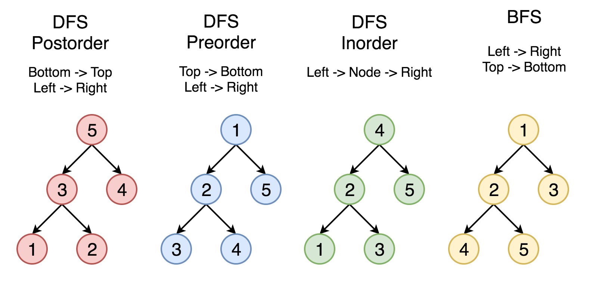

# Binary Tree

There are four critical operations in binary tree: add, delete, search and modify. Here, we need to practice different way to traverse the tree, including preorder, inorder and post order traversal. Furthermore, we need to learn different search way to recursive or iteratively search the tree, that is, depth first search (DFS) or backtracking and breadth first search (BFS).

To training those skills, we need to take lots of subjects, and we also need to use those method on graph and array.

We will introduce those patterns here so don't afraid of that.


> Note: Direction is the most important thing in binary tree !

## Traversal
### Template
In linked list
```c++
class ListNode {
    int val;
    ListNode next;
};

// iterative traversal
void iteration_tarverse(ListNode head) {
    for(...)
        iteration_tarverse(...)
}

// order traversal
void recursive_traverse(ListNode head) {

    // no matter which traverse it is,
    // check the boundary condition first

    //preorder traverse (do something before traverse)
    recursive_traverse(...)
    //postorder traverse (do something after traverse)
}
```

For example, there is a linked list. Please print the value of each node in preorder and postorder
```txt
1->2->3->4->5->6
```

> Note: the direction of preorder traversal is left to right

If i use preorder traversal, the sample code is like this:
```c++
void recursive_traverse(ListNode head) {
    printf("%d ", head.val);
    recursive_traverse(head.next);
}
```
and the result is
```txt
1 2 3 4 5 6
```
> Note: the direction of preorder traversal is right to left

If I use the postorder traversal, the sample code is like this:
```c++
void recursive_traverse(ListNode head) {
    recursive_traverse(head.next);
    printf("%d ", head.val);
}
```
and the result is
```txt
6 5 4 3 2 1
```

In binary tree, there is three kinds of order traversal, preorder, inorder and postorder

and the basic template we use is like this:
```c++
class TreeNode {
    int val;
    TreeNode left, right;
};

void traverse(TreeNode root) {

    // no matter which traverse it is,
    // check the boundary condition first

    //preorder traverse
    traverse(root->left)
    //inorder traverse
    traverse(root->right)
    //postorder traverse
}
```

And we can use this template to pass following example

### [Inorder Traversal](https://leetcode.com/problems/binary-tree-inorder-traversal/)
```c++
/**
 * Definition for a binary tree node.
 * struct TreeNode {
 *     int val;
 *     TreeNode *left;
 *     TreeNode *right;
 *     TreeNode() : val(0), left(nullptr), right(nullptr) {}
 *     TreeNode(int x) : val(x), left(nullptr), right(nullptr) {}
 *     TreeNode(int x, TreeNode *left, TreeNode *right) : val(x), left(left), right(right) {}
 * };
 */
class Solution {
public:
    void inorder(TreeNode *root, vector<int>& ans) {
        if(root==nullptr)
            return;

        inorder(root->left, ans);
        ans.push_back(root->val);
        inorder(root->right, ans);
    }
    vector<int> inorderTraversal(TreeNode* root) {
        if(root==nullptr)
            return {};
        vector<int> ans;
        inorder(root, ans);
        return ans;
    }
};
```
more subjects, [preorder traversal](https://leetcode.com/problems/binary-tree-preorder-traversal/) and [postorder traversal](https://leetcode.com/problems/binary-tree-postorder-traversal/description/)

The concept of traversal is the fundamental essence of backtracking.

And there is a traversal method, we do not use, which is level order traversal, and that is, BFS(breath first search)

### [Level order traversal](https://leetcode.com/problems/binary-tree-level-order-traversal/description/)

```c++
/**
 * Definition for a binary tree node.
 * struct TreeNode {
 *     int val;
 *     TreeNode *left;
 *     TreeNode *right;
 *     TreeNode() : val(0), left(nullptr), right(nullptr) {}
 *     TreeNode(int x) : val(x), left(nullptr), right(nullptr) {}
 *     TreeNode(int x, TreeNode *left, TreeNode *right) : val(x), left(left), right(right) {}
 * };
 */
class Solution {
public:
    vector<vector<int>> levelOrder(TreeNode* root) {
        if(root == nullptr)
            return {};

        vector<vector<int>> ans;
        queue<TreeNode *> q;

        q.push(root);

        while(!q.empty()) {
            int n = q.size();
            vector<int> order;

            for(int i = 0; i < n; i++) {
                TreeNode *node = q.front();
                q.pop();

                order.push_back(node->val);
                if(node->left)
                    q.push(node->left);
                if(node->right)
                    q.push(node->right);
            }

            ans.push_back(order);
        }

        return ans;
    }
};
```
#### Some challange here
Can you use DFS to solve this ?

> Note: this is preorder traversal, notice the direction!
```c++
class Solution {
public:
    void dfs(TreeNode *root, vector<vector<int>>& ans, int depth) {
        if(root == nullptr)
            return;

        if(ans.size() <= depth) 
            ans.push_back({});

        ans[depth].push_back(root->val);
        dfs(root->left, ans, depth + 1);
        dfs(root->right, ans, depth + 1);
    }
    vector<vector<int>> levelOrder(TreeNode* root) {
        vector<vector<int>> ans;
        int depth = 0;
        dfs(root, ans, depth);
        return ans;
    }
};
```

### Summary


## How to construct a tree ?
subjects: 105, 106, 889

This kind of problem is not intuition for freshman, so we need to analyze and practice.

A basic idea for these kind of question.
1. Use the property of these array.
    - preorder: the root node is first node
    - postorder: the root node is the last node in the vector
    - inorder: we can use this to find the left boundary and right boundary
    - hashtable: use this to memorize inorder element with its index
2. Step
   1. Before we start recursive construct the tree, we need to use hashtable to memorize the inorder vector element with its index
   2. Recursive Start
   3. Boundary check, check the boundary is legal, if not, then return `nullptr`
   4. `malloc` a new tree with `pre_s`
   5. get the `pre_s` element in inorder index, and we can use this to know left boundary and right boundary
   6. recursive to sub-tree
3. Design
   1. function prototype
   2. boundary condition

### [105. Construct Binary Tree from Preorder and Inorder Traversal](https://leetcode.com/problems/construct-binary-tree-from-preorder-and-inorder-traversal/description/)
```c++
/**
 * Definition for a binary tree node.
 * struct TreeNode {
 *     int val;
 *     TreeNode *left;
 *     TreeNode *right;
 *     TreeNode() : val(0), left(nullptr), right(nullptr) {}
 *     TreeNode(int x) : val(x), left(nullptr), right(nullptr) {}
 *     TreeNode(int x, TreeNode *left, TreeNode *right) : val(x), left(left), right(right) {}
 * };
 */
class Solution {
public:
    TreeNode* build(vector<int>& preorder, vector<int>& inorder, 
                    unordered_map<int, int>& inorder_map, 
                    int pre_s, int in_s, int in_e) {
        // boundary condition
        if(pre_s > inorder.size() || in_s > in_e)
            return nullptr;
        
        // make a new root node
        TreeNode *root = new TreeNode(preorder[pre_s]);

        // find the corresponding index in inorder vector
        int root_i = inorder_map[preorder[pre_s]];

        root->left = build(preorder, inorder, inorder_map, pre_s + 1, in_s, root_i - 1);
        root->right = build(preorder, inorder, inorder_map, pre_s + root_i - in_s + 1, root_i + 1, in_e);

        return root;
    }
    TreeNode* buildTree(vector<int>& preorder, vector<int>& inorder) {
        // record the value of node and the index of node
        unordered_map<int, int> inorder_map;
        int n = inorder.size();

        for(int i = 0; i < n; i++)
            inorder_map[inorder[i]] = i;
        
        return build(preorder, inorder, inorder_map, 0, 0, n - 1);
    }
};
```

In the [889. Construct Binary Tree from Preorder and Postorder Traversal](https://leetcode.com/problems/construct-binary-tree-from-preorder-and-postorder-traversal/description/)
```c++
/**
 * Definition for a binary tree node.
 * struct TreeNode {
 *     int val;
 *     TreeNode *left;
 *     TreeNode *right;
 *     TreeNode() : val(0), left(nullptr), right(nullptr) {}
 *     TreeNode(int x) : val(x), left(nullptr), right(nullptr) {}
 *     TreeNode(int x, TreeNode *left, TreeNode *right) : val(x), left(left), right(right) {}
 * };
 */
class Solution {
public:
    TreeNode* build(vector<int>& preorder, vector<int>& postorder,
                    unordered_map<int, int>& post_map, unordered_map<int, int>& pre_map,
                    int pre_s, int post_s, int post_e) {
        if(pre_s >= preorder.size() || post_e < 0 || post_s > post_e)
            return nullptr;

        TreeNode *root = new TreeNode(preorder[pre_s]);
        if(post_s == post_e)
            return root;
        int root_left = post_map[preorder[pre_s + 1]];
        int pre_right = pre_map[postorder[post_e - 1]];

        root->left = build(preorder, postorder, post_map, pre_map, pre_s + 1, post_s, root_left);
        root->right = build(preorder, postorder, post_map, pre_map, pre_right, root_left + 1, post_e - 1);
        return root;
    }
    TreeNode* constructFromPrePost(vector<int>& preorder, vector<int>& postorder) {
        unordered_map<int, int> post_map, pre_map;
        int n = postorder.size();

        for(int i = 0; i < n; i++)
            post_map[postorder[i]] = i;

        for(int i = 0; i < n; i++)
            pre_map[preorder[i]] = i;

        return build(preorder, postorder, post_map, pre_map, 0, 0, n - 1);
    }
};
```
We can optimize this (**TODO**)
```c++
class Solution {
public:
    int cur = 0;
    TreeNode* solve(vector<int>& preorder,int l,int r, unordered_map<int,int> &mp) {
        if(l > r)
            return nullptr;

        int node_val = preorder[cur++];
        TreeNode* node = new TreeNode(node_val);

        if(l == r)
            return node;
        
        if(cur >= preorder.size())
            return nullptr;
        
        int partition = mp[preorder[cur]];
    
        node->left = solve(preorder, l, partition, mp);
        node->right = solve(preorder, partition + 1, r - 1, mp);

        return node;
    }
    TreeNode* constructFromPrePost(vector<int>& preorder, vector<int>& postorder) {
        unordered_map<int,int> mp;

        for(int i = 0;i < postorder.size(); i++)
            mp[postorder[i]] = i;

        return solve(preorder, 0, preorder.size() - 1, mp);
    }
};
```

### Backtracking
backtracking is "enumerate". If we want to use backtracking method, we need to consider three problems:
1. Path: the choice we made
2. Choice list: which we can choose
3. Termination condition: when we arrive the bottom of tree, we cannot do any choice

There is a template for backtracking:
```c++
vector<int> ans;

vector<int> backtracking(/* path */, /* choices*/) {
    if(/* termination condition */) {
        ans.push_back(result);
        return;
    }

    for (auto choice : choice lists) {
        //do some choice
        backtracking();
        //cancel the chcoice
    }
}
```

### Example
[113. Path Sum II](https://leetcode.com/problems/path-sum-ii/description/)

Original one:
```c++
class Solution {
    vector<vector<int>> ans;
public:
    void dfs(TreeNode *root, int target, vector<int> path) {
        if(root == nullptr)
            return;

        path.push_back(root->val);
        if(target - root->val == 0 && !root->left && !root->right) { 
            ans.push_back(path);
            return;
        }

        dfs(root->left, target - root->val, path);
        dfs(root->right, target - root->val, path);
    }
    vector<vector<int>> pathSum(TreeNode* root, int targetSum) {
        if(root == nullptr)
            return {};
        vector<int> path;
        dfs(root, targetSum, path);
        return ans;
    }
};
```

Here, we notice that we pass all vector to recursion, this is very inefficient. We can use "cancel the choice" to improve it

That is:
```diff
-        if(target - root->val == 0 && !root->left && !root->right) { 
-            ans.push_back(path);
-            return;
-        }
+        if(target - root->val == 0 && !root->left && !root->right) { 
+            ans.push_back(path);
+        } else {
+            ...
+        }
+        path.pop_back();
```

Code:
```c++
class Solution {
    vector<vector<int>> ans;
public:
    void dfs(TreeNode *root, int target, vector<int>& path) {
        if(root == nullptr)
            return;

        path.push_back(root->val);
        if(target - root->val == 0 && !root->left && !root->right) { 
            ans.push_back(path);
        } else {
            dfs(root->left, target - root->val, path);
            dfs(root->right, target - root->val, path);
        }
        path.pop_back();
    }
    vector<vector<int>> pathSum(TreeNode* root, int targetSum) {
        if(root == nullptr)
            return {};
        vector<int> path;
        dfs(root, targetSum, path);
        return ans;
    }
};
```

And, we can also use BFS to solve this.
**TODO**

### Find the ancestor


## Reference
- [Leetcode刷題學習筆記–Tree Traversal](https://hackmd.io/@meyr543/r1lbVkb-K)