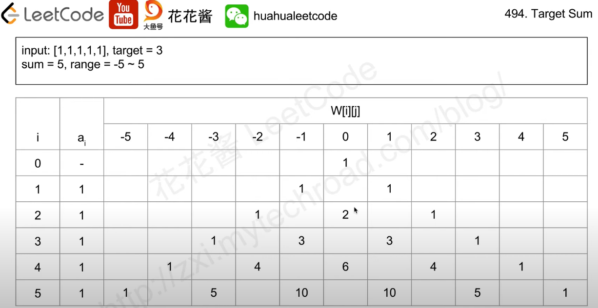

# 494. Target Sum

### Brute Force, backtracking
```python
def dfs(path, choices):
    if terminal_condition:
        result.add(path)
        return
    for choice in choices:
        choice
        dfs(path, choices)
        cancel_the_choice
```


```c++
class Solution {
public:
    int result = 0;
    void dfs(vector<int>& nums, int start, int target) {
        if(start == nums.size()) {
            if(target == 0)
                result++;
            return;
        }

        dfs(nums, start + 1, target - nums[start]);
        dfs(nums, start + 1, target + nums[start]);      
    }
    int findTargetSumWays(vector<int>& nums, int target) {
        dfs(nums, 0, target);
        return result;
    }
};
```
Result: Time Limit Exceeded


Add a record to remember the state
```c++
class Solution {
    unordered_map<string, int> memorization;
public:
    int dfs(vector<int>& nums, int start, int target) {
        if(start == nums.size()) {
            if(target == 0)
                return 1;
            return 0;
        }

        string key = to_string(start) + "," + to_string(target);

        if(memorization.count(key))
            return memorization[key];

        int result = 0;
        result += dfs(nums, start + 1, target - nums[start]);
        result += dfs(nums, start + 1, target + nums[start]);      
        
        memorization[key] = result;
        return memorization[key];
    }
    int findTargetSumWays(vector<int>& nums, int target) {
        return dfs(nums, 0, target);
    }
};
```


### dp
想法是用現在陣列的元素看看可以湊出多少值，只要看 `target` 在不在這些值得集合中就可以得到結果

`dp[i][j]` 代表 `nums[0 ~ i]` 有幾種方式可以達成 `j`

狀態轉移方程： `dp[i][j] = dp[i - 1][j - nums[i]] + dp[i - 1][j + nums[i]]`



```c++
class Solution {
public:
    int findTargetSumWays(vector<int>& nums, int target) {
        const int n = nums.size();
        const int sum = accumulate(nums.begin(), nums.end(), 0);

        if(sum < target || target < -sum)
            return 0;

        vector<vector<int>> ways(n + 1, vector<int>(sum + sum + 1, 0));

        ways[0][sum] = 1;

        for(int i = 0; i < n; i++) {
            for(int j = nums[i]; j < 2 * sum + 1 - nums[i]; j++) {
                if(ways[i][j]) {
                    ways[i + 1][j + nums[i]] += ways[i][j];
                    ways[i + 1][j - nums[i]] += ways[i][j];
                }
            }
        }

        return ways[n][target + sum];
    }
};
```