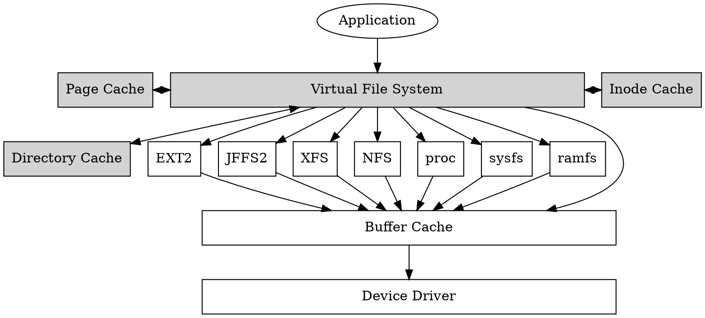

# 深入理解 Linux 檔案系統

> 聲明：因應工作需求，本文使用的 Linux 核心版本為 [`5.10.181`](https://elixir.bootlin.com/linux/v5.10.181/source) 不是最新的發行版

實驗環境
- 設備： macbook pro m1 max
- 作業系統： parallel ubuntu debian

```
$ uname -a
Linux ubuntu-linux-20-04-desktop 5.13.0-25-generic #26~20.04.1-Ubuntu SMP Sat Jan 8 18:05:46 UTC 2022 aarch64 aarch64 aarch64 GNU/Linux
```

實驗[程式碼]()

### Outline
- 檔案系統概述
- 檔案系統怎麼使用
- 一般的 `Linux` 檔案系統 (`ext2`, `xfs`)
- 嵌入式設備使用的檔案系統 (`jffs2`, `ubifs`)
- 網路的檔案系統 (`nfs`)
- 分散式檔案系統 (`dfs`)

## 檔案系統概述
檔案系統的使用分為兩個層面，一是普通使用者的角度，二是應用程式 (application) 開發者的角度。

從普通使用者來說，檔案系統的使用無非是增(create)、刪(delete)、查(search)、改(modify)。從開發者來說，除了這幾個功用之外，需要對一些檔案系統有更深入的理解，像是怎麼樣可以繞過快取 (cache) ，怎麼樣給檔案加鎖 (lock) 等等。

本文主要已開發者的角度進行撰寫，會從用戶空間 (user space) 的使用方式慢慢深入到核心空間 (kernel space) 看看核心設計者是怎麼實作這些功能的。

使用者眼中的檔案系統檔案系統主要由檔案 (file)、目錄 (directory) 及連結 (link) 所組成


## 如何使用檔案系統
在這個章節，我們以用戶空間的開發者作為基礎說明一些基本的檔案系統機制，例如檔案讀寫、目錄的操作、許可權的處理與文件系統的掛載

### 對檔案進行讀寫
參考程式碼 [`cp.c`](https://github.com/zoanana990/note/blob/main/fs/cp/cp.c) 這個程式碼是一個簡單的 Linux `cp` 的命令，這裡用到四個函式 `fopen`, `fread`, `fwrite`, `fclose` 這邊簡單看一下程式碼

```c=16
// 打開檔案, 以 read 的方式
source_file = fopen(argv[1], "rb");

// 不能保證一次寫完檔案，一次寫 1024 bytes
while ((bytes_read = fread(buffer, 1, BUFFER_SIZE, source_file)) > 0) {
    fwrite(buffer, 1, bytes_read, target_file);
}

// 做完之後把檔案關閉
fclose(source_file);
```

直接在終端機上面 `make` 就可以編譯了，測試命令如下：
```
$ touch test
$ echo "hello" > test
$ cat test
hello
$ ./cp test hello
$ cat hello
hello
```

輸出上面所是代表複製檔案成功，程式碼裡面的 `fopen`, `fread`, `fwrite`, `fclose` 可以使用 `open`, `read`, `write`, `close` 代替，寫法也非常類似，差別在於 `fopen` 系列的是 C 語言定義的函式，而 `open` 系列的是 POSIX 標準的函式，同時也是系統呼叫 (system call)。後面的章節會介紹這些系統呼叫的實作


### 對目錄進行操作

上面這個例子只有對檔案進行操作，這個案例就是列出目錄中所有檔案，參考程式碼 [ls.c](https://github.com/zoanana990/note/blob/main/fs/ls/ls.c)
當編譯完成之後可以使用 `./ls` 進行測試。

如果想要列出每個檔案的細節，像是 `ls -a` 會需要使用到 `struct stat`，這邊不是我們的重點，可以參考 `glibc` 的實作

### 檔案系統的格式化與掛載


### 許可權管理
#### RWX-UGO 許可權管理
Linux 最常用的許可詮釋 RWX-UGO 的許可權管理。其中，RWX 是 Read, Write, eXecution 的縮寫，而 UGO 是 User, Droup 和 other 的縮寫。當我們在終端機輸入命令 `ls -alh` 會列出下面的資訊：
```shell
$ ls -alh
total 52K
drwxr-xr-x 1 khienh dialout 160 Dec  9 08:16 .
drwxr-xr-x 1 khienh dialout 128 Dec  9 08:14 ..
-rw-r--r-- 1 khienh dialout 107 Dec  9 08:16 Makefile
-rwxr-xr-x 1 khienh dialout 33K Dec  9 08:16 ls
-rw-r--r-- 1 khienh dialout 409 Dec  9 08:15 ls.c
```
其中， `drwxr-xr-x` 是許可權資訊、`khienh` 是所屬使用者、`dialout` 是所屬群組。

我們可以利用 `chmod` 改變我們的許可權資訊，這邊先介紹許可權資訊，以 `drwxr-xr-x` 為例:
```txt
d | rwx | r-x | r-x
```

- 第一個字母，`d` 是 `directory`、`c` 是字符裝置 (character device)、`b` 是塊裝置 (block device)、`-` 是普通的檔案 
- 由左到右，第一區的 `rwx` 是代表使用者權限
- 由左到右，第二區的 `rwx` 是代表所屬群組的權限，以這個例子來說可以讀和可以執行
- 由左到右，第三區的 `rwx` 是代表其他使用者的權限
- 這些表示權限的三個字母，如果是 `-` 就代表沒有這個權限，如果有出現 `r` 代表可以讀，`w` 代表可以寫，`x` 代表可以執行。

`chmod 777 xxx` 代表賦予 `xxx` 這個檔案可讀可寫可以執行的權限，其中，`chmod` 代表的是 change mode 的縮寫。
```shell
# 增加可以執行的許可權
$ chmod +x test.bin

# 增加可讀可寫可執行的許可權
$ chmod 777 test.bin
```

定義如 [stat.h](https://elixir.bootlin.com/linux/v5.10.181/source/include/uapi/linux/stat.h#L29)
```c=29
#define S_IRWXU 00700
#define S_IRUSR 00400
#define S_IWUSR 00200
#define S_IXUSR 00100

#define S_IRWXG 00070
#define S_IRGRP 00040
#define S_IWGRP 00020
#define S_IXGRP 00010

#define S_IRWXO 00007
#define S_IROTH 00004
#define S_IWOTH 00002
#define S_IXOTH 00001
```

當然還可以用 `chown` 改寫檔案的所屬使用者資訊，和 `chgrd` 還改變檔案的群組資訊等等。 RWX-UGO 的控制權就介紹到這了。

#### ACL 許可權管理

### 鎖住檔案

## Linux 檔案系統的實作



### 檔案系統的掛載


### Reference


