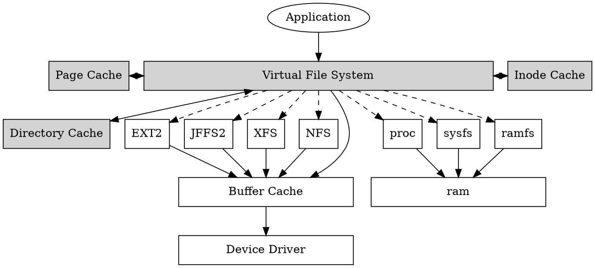
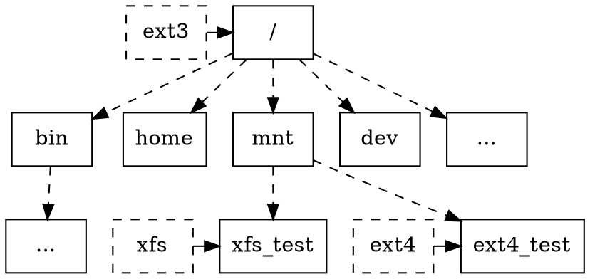

深入理解 Linux 檔案系統
===
:::info
學習目標
1. 檔案系統是的 `open`, `read`, `write`, `close` 是怎麼實作的？
2. 檔案系統掛載的目的是什麼？
3. 檔案系統是怎麼實現使用者權限的更改的？
4. 檔案系統是怎麼和加載器 (loader, `execve`) 合作的？
5. 在一個檔案系統中，為什麼一些字符設備 (character device) 會有不同的打開方式？
6. 檔案描述子 (file descriptor) 是怎麼產生的？他又是怎麼和文件產生連結的？

如果這些問題你都可以清楚地回答出來。恭喜你，這篇文章對你沒有什麼幫助，但是如果你對這些問題沒有概念，那你可以繼續閱讀來了解檔案系統的運作原理。
:::

# 目錄
- 檔案系統概述
- 檔案系統怎麼使用
- 檔案系統的結構介紹
- `jffs2` 檔案系統介紹
- NAND flash 介紹
- 深度解析 `jffs2` 檔案系統操作的實作
- `ext2` 檔案系統介紹
- 深度解析 `ext2` 檔案系統操作的實作
- 設計與實作一個檔案系統

> 聲明：因應工作需求，本文使用的 Linux 核心版本為 [`5.10.181`](https://elixir.bootlin.com/linux/v5.10.181/source) 不是最新的發行版
> 
> 本文主要觀察 `ext2` 和 `jffs2`。因為 `ext2` 是基於 block device 的檔案系統而 `jffs2` 是基於 mtd device 的檔案系統。

### 實驗環境
- 設備： macbook pro m1 max
- 作業系統： parallel ubuntu debian

```
$ uname -a
Linux ubuntu-linux-20-04-desktop 5.13.0-25-generic #26~20.04.1-Ubuntu SMP Sat Jan 8 18:05:46 UTC 2022 aarch64 aarch64 aarch64 GNU/Linux
```

# 檔案系統概述
檔案系統的使用分為兩個層面，一是普通使用者的角度，二是應用程式 (application) 開發者的角度。

從普通使用者來說，檔案系統的使用無非是增(create)、刪(delete)、查(search)、改(modify)。從開發者來說，除了這幾個功用之外，需要對一些檔案系統有更深入的理解，像是怎麼樣可以繞過快取 (cache) ，怎麼樣給檔案加鎖 (lock) 等等。

本文主要已開發者的角度進行撰寫，會從用戶空間 (user space) 的使用方式慢慢深入到核心空間 (kernel space) 看看核心設計者是怎麼實作這些功能的。

使用者眼中的檔案系統檔案系統主要由檔案 (file)、目錄 (directory) 及連結 (link) 所組成


## 如何使用檔案系統
在這個章節，我們以用戶空間的開發者作為基礎說明一些基本的檔案系統機制，例如檔案讀寫、目錄的操作、許可權的處理與檔案系統的掛載

### 對檔案進行讀寫
參考程式碼 [`cp.c`](https://github.com/zoanana990/note/blob/main/fs/cp/cp.c) 這個程式碼是一個簡單的 Linux `cp` 的命令，這裡用到四個函式 `fopen`, `fread`, `fwrite`, `fclose` 這邊簡單看一下程式碼

```c=16
// 打開檔案, 以 read 的方式
source_file = fopen(argv[1], "rb");

// 不能保證一次寫完檔案，一次寫 1024 bytes
while ((bytes_read = fread(buffer, 1, BUFFER_SIZE, source_file)) > 0) {
    fwrite(buffer, 1, bytes_read, target_file);
}

// 做完之後把檔案關閉
fclose(source_file);
```

直接在終端機上面 `make` 就可以編譯了，測試命令如下：
```
$ touch test
$ echo "hello" > test
$ cat test
hello
$ ./cp test hello
$ cat hello
hello
```

輸出上面所是代表複製檔案成功，程式碼裡面的 `fopen`, `fread`, `fwrite`, `fclose` 可以使用 `open`, `read`, `write`, `close` 代替，寫法也非常類似，差別在於 `fopen` 系列的是 C 語言定義的函式，而 `open` 系列的是 POSIX 標準的函式，同時也是系統呼叫 (system call)。後面的章節會介紹這些系統呼叫的實作


### 對目錄進行操作

上面這個例子只有對檔案進行操作，這個案例就是列出目錄中所有檔案，參考程式碼 [ls.c](https://github.com/zoanana990/note/blob/main/fs/ls/ls.c)
當編譯完成之後可以使用 `./ls` 進行測試。

如果想要列出每個檔案的細節，像是 `ls -a` 會需要使用到 `struct stat`，這邊不是我們的重點，可以參考 `glibc` 的實作

### 檔案系統的格式化與掛載
一班在使用格式化的時候我們會使用 `mkfs` 當空間格式化完成之後才會將檔案系統進行掛載，掛載的命令會使用 `mount`。由此可知，每個檔案系統都需要在 linux kernel 中提供 `mount` 的函式。`mount` 的部分在後面會提到，這邊先看格式化的部分。

:::warning
### 延伸閱讀
在 `/dev` 底下總是有一些奇奇怪怪的檔案和目錄，看到但是又不知道那些是什麼東西，有的時候掛載檔案系統時會用到，這邊讓進行解析。

#### Block devices
Block devices 可透過 `/dev` 中的檔案節點來存取。一個 Block 只能處理一到多個完整 Block 的 I/O 操作，大小為 512 bytes (或是更大的2的次方)。Linux 可以讓讀取 Block device 如同操作File 一樣，而不用一次讀一整個 Block，在 User Space 中使用與 Char device 基本上無差別。有差別的是在 Kernel Driver 這一層完全不同。

#### Character devices
Character devices 可以被當作位元組流 (A stream of bytes) 來被存取，就像一般的檔案 (File) 一樣。因此 Char dirver 就要負責至少 `open`, `close`, `read`, 和 `write` 的系統呼叫 (system call) 操作，有的還有提供 `ioctl` 的操作方式。常見的例子有 Text Console `/dev/console` 和 Serial Ports `/dev/ttyS0`，都是位元組流結構。Char devices 由檔案系統的節點 (Filesystem node) 來存取，像是 `/dev/tty1` 和 `/dev/lp0`。

但跟一般檔案不同的是，一般檔案可以把指標往前往後來操作檔案，但是多數 Char device 只能依序存取。當然也有例外，可以用 `mmap` 或是 `lseek` 將檔案的位置指標進行移動。

#### Block 與 Character 的差異
Block devices 是以固定大小長度來傳送轉移資料，而 Character devices 是以不定長度的字元傳送資料，而其操作方式在使用者空間大同小異。

#### `/dev` 底下常見的檔案
- `/dev/mem` 實體記憶體
- `/dev/kmem` 虛擬記憶體
- `/dev/ram0` 第 0 個 ram disk，請使用 `tmpfs` 這個已經過時了
- `/dev/mtd` 代表的是 [`mtd`](https://en.wikipedia.org/wiki/Memory_Technology_Device)

其他的去看 [devices.txt](https://github.com/torvalds/linux/blob/master/Documentation/admin-guide/devices.txt)，裡面有詳細的介紹

:::

### 許可權管理
#### RWX-UGO 許可權管理
Linux 最常用的許可詮釋 RWX-UGO 的許可權管理。其中，RWX 是 Read, Write, eXecution 的縮寫，而 UGO 是 User, Droup 和 other 的縮寫。當我們在終端機輸入命令 `ls -alh` 會列出下面的資訊：
```shell
$ ls -alh
total 52K
drwxr-xr-x 1 khienh dialout 160 Dec  9 08:16 .
drwxr-xr-x 1 khienh dialout 128 Dec  9 08:14 ..
-rw-r--r-- 1 khienh dialout 107 Dec  9 08:16 Makefile
-rwxr-xr-x 1 khienh dialout 33K Dec  9 08:16 ls
-rw-r--r-- 1 khienh dialout 409 Dec  9 08:15 ls.c
```
其中， `drwxr-xr-x` 是許可權資訊、`khienh` 是所屬使用者、`dialout` 是所屬群組。

我們可以利用 `chmod` 改變我們的許可權資訊，這邊先介紹許可權資訊，以 `drwxr-xr-x` 為例:
```txt
d | rwx | r-x | r-x
```

- 第一個字母，`d` 是 `directory`、`c` 是字符裝置 (character device)、`b` 是塊裝置 (block device)、`-` 是普通的檔案 
- 由左到右，第一區的 `rwx` 是代表使用者權限
- 由左到右，第二區的 `rwx` 是代表所屬群組的權限，以這個例子來說可以讀和可以執行
- 由左到右，第三區的 `rwx` 是代表其他使用者的權限
- 這些表示權限的三個字母，如果是 `-` 就代表沒有這個權限，如果有出現 `r` 代表可以讀，`w` 代表可以寫，`x` 代表可以執行。

`chmod 777 xxx` 代表賦予 `xxx` 這個檔案可讀可寫可以執行的權限，其中，`chmod` 代表的是 change mode 的縮寫。
```shell
# 增加可以執行的許可權
$ chmod +x test.bin

# 增加可讀可寫可執行的許可權
$ chmod 777 test.bin
```

定義如 [stat.h](https://elixir.bootlin.com/linux/v5.10.181/source/include/uapi/linux/stat.h#L29)
```c=29
#define S_IRWXU 00700
#define S_IRUSR 00400
#define S_IWUSR 00200
#define S_IXUSR 00100

#define S_IRWXG 00070
#define S_IRGRP 00040
#define S_IWGRP 00020
#define S_IXGRP 00010

#define S_IRWXO 00007
#define S_IROTH 00004
#define S_IWOTH 00002
#define S_IXOTH 00001
```

當然還可以用 `chown` 改寫檔案的所屬使用者資訊，和 `chgrd` 還改變檔案的群組資訊等等。 RWX-UGO 的控制權就介紹到這了。

# Linux 檔案系統架構
檔案系統是 Linux 核心中的四大子系統之一(行程管理、記憶體管理、網路子系統)，因此程式碼非常的繁雜。光是虛擬檔案系統的抽象層就已經多達五萬多行，還沒有包含任何一個檔案系統，下面先介紹一下 Linux 檔案系統的整體架構，如下圖所示：

> 這邊有兩張圖主要是因為 github 不支援 graphviz 的顯示
> 
> 後面都會採用下面這種圖


由上圖可以看到，由於 Linux 需要對接很多不同的檔案系統。因此，Linux 將檔案系統進行抽象為虛擬檔案系統(Virtual File System, 以下稱 VFS)，虛擬檔案系統主要提供以下的功用：
1. 將所有 API 提供統一的介面。例如：`open`, `read`, `write`, `close`, `mount` 等等。
2. 很多共同的功能，例如：inode cache, page cache, directory cache 等等。
3. 規範檔案系統應該要實作哪一些功能。當檔案系統完成 VFS 規範的功能時，將他註冊到進 Linux 之後，就可以使用其功能。

下圖是一個 Linux 目錄樹，可以看到 `rootfs` 是 `ext3`。在 `mnt` 中又要掛載 `xfs` 和 `ext4`。Linux 是可以掛載不同的檔案系統的，只要你把空間格式化好之後就可以進行掛載，後面會再更詳述掛載的原理。



### 從 `VFS` 到檔案系統

`VFS` 為使用這提供共同的介面，每一支 `API` 都會與一個核心函式進行對應，下表示比較常用的檔案系統操作。

| User space API | kernel space |
| -------- | -------- |
| `open`   | [`do_sys_open`](https://elixir.bootlin.com/linux/v5.10.181/source/fs/open.c#L1206) |
| `read`   | [`ksys_read`](https://elixir.bootlin.com/linux/v5.10.181/source/fs/read_write.c#L623) |
| `write`  | [`ksys_write`](https://elixir.bootlin.com/linux/v5.10.181/source/fs/read_write.c#L647) |
| `close`  | [`__close_fd`](https://elixir.bootlin.com/linux/v5.10.181/source/fs/open.c#L1311) |
| `mount`  | [`do_mount`](https://elixir.bootlin.com/linux/v5.10.181/source/fs/namespace.c#L3450) |

現在已經知道使用者的系統呼叫和核心函式的關係了，至於 VFS 是怎麼呼叫到具體的檔案系統呢？在後面的文章會進行說明。現在的當務之急是要把虛擬檔案系統的幾個重要的結構進行介紹。

# 檔案系統的結構
檔案系統的結構設計起來錯綜複雜，當一個行程 (process) 去開啟一個檔案的時候可以是下面這樣的


這張圖看起來十分複雜，而實際情況又比這張圖要複雜得多，因為有很多結構是互相關連的，而這個又沒有辦法一時之前解釋清楚。只能 ***耐心的*** 將每一個結構成員看清楚，不要想走捷徑。

第一個要介紹的結構是用來註冊檔案系統的，[`file_system_type`](https://elixir.bootlin.com/linux/v5.10.181/source/include/linux/fs.h#L2246)
```c=2245
/* /include/linux/fs.h */
struct file_system_type {
    
    /* 檔案系統的名稱 */
    const char *name;
    
    /* 檔案系統類型的標誌 */
    int fs_flags;
    
/* 檔案系統保存在外部設備 */    
#define FS_REQUIRES_DEV        1
...
    
    /* 檔案系統初始化的函式給不是使用 block device 的檔案系統使用 */
    int (*init_fs_context)(struct fs_context *);
    const struct fs_parameter_spec *parameters;
    
    /* 掛載用的函式 */
    struct dentry *(*mount) (struct file_system_type *, int,
               const char *, void *);
    void (*kill_sb) (struct super_block *);
    struct module *owner;
    
    /* 單向鏈結串列，這裡沒有使用 list API */
    struct file_system_type * next;
    
    /* 雜湊表，用來對接 super_block 用的 */
    struct hlist_head fs_supers;

    ... /* 省略 lock 的結構 */
};
```

接下來看一下註冊函式 [`register_filesystem`](https://elixir.bootlin.com/linux/v5.10.181/source/fs/filesystems.c#L72)
```c=59
/**
 *    register_filesystem - register a new filesystem
 *    @fs: the file system structure
 *
 *    Adds the file system passed to the list of file systems the kernel
 *    is aware of for mount and other syscalls. Returns 0 on success,
 *    or a negative errno code on an error.
 *
 *    The &struct file_system_type that is passed is linked into the kernel 
 *    structures and must not be freed until the file system has been
 *    unregistered.
 */
 
int register_filesystem(struct file_system_type * fs)
{
    int res = 0;
    struct file_system_type ** p;

    p = find_filesystem(fs->name, strlen(fs->name));
    if (*p)
        res = -EBUSY;
    else
        *p = fs;
    return res;
}
```
`register_filesystem` 主要是執行函式 [`find_filesystem`](https://elixir.bootlin.com/linux/v5.10.181/source/fs/filesystems.c#L49)
```c=49
static struct file_system_type **find_filesystem(const char *name, unsigned len)
{
    struct file_system_type **p;
    
    /* 走訪 file_system_type 的鏈結串列 */
    for (p = &file_systems; *p; p = &(*p)->next)
        /* 如果這個 filesystem 已經被註冊的話就回傳這個指標 */
        if (strncmp((*p)->name, name, len) == 0 &&
            !(*p)->name[len])
            break;
    return p;
}
```
由此可知，每次註冊的 `file_system_type` 都會放到鏈結串列的尾巴。由下圖所示：


可以透過 
```shell
cat /proc/filesystems
```
查看 kernel 支援檔案系統的類型

```shell
$ cat /proc/filesystems 
nodev    sysfs
nodev    tmpfs
nodev    bdev
nodev    proc
nodev    cgroup
nodev    cgroup2
nodev    cpuset
nodev    devtmpfs
nodev    configfs
nodev    debugfs
...
```
接下來看 `ext2` 和 `jffs2` 初始化檔案系統的過程

### 檔案系統的註冊
程式碼: [init_ext2_fs](https://elixir.bootlin.com/linux/v5.10.181/source/fs/ext2/super.c#L1647)
```c=1647
static int __init init_ext2_fs(void)
{
    // 使用 slab 分配器創造記憶體空間
    err = init_inodecache();
    
    // 將檔案系統註冊到 linux 中
    err = register_filesystem(&ext2_fs_type);

    return 0;
}
```

1. [`init_inodecache`](https://elixir.bootlin.com/linux/v5.10.181/source/fs/ext2/super.c#L215)，這個函式是給 `ext2` 分配記憶體空間以加速檔案系統的運作，分配的方式會在記憶體篇進行說明。
2. [`register_filesystem`](https://elixir.bootlin.com/linux/v5.10.181/source/fs/filesystems.c#L72)，將 `ext2_fs_type` 加入檔案系統的鏈結串列中。

`ext2_fs_type` 其實就是一個全域變數，結構成員就是模組名稱、掛載的函式指標等等
```c=1638
static struct file_system_type ext2_fs_type = {
    .owner    = THIS_MODULE,
    .name     = "ext2",
    .mount    = ext2_mount,
    .kill_sb  = kill_block_super,
    .fs_flags = FS_REQUIRES_DEV,
};
```

接下來讓我們觀察 `jffs2` 的初始化流程。程式碼: [init_jffs2_fs](https://elixir.bootlin.com/linux/v5.10.181/source/fs/jffs2/super.c#L361)

```c=361
static int __init init_jffs2_fs(void)
{
    int ret;
    jffs2_inode_cachep = kmem_cache_create(...);
    ret = jffs2_compressors_init();
    ret = jffs2_create_slab_caches();
    ret = register_filesystem(&jffs2_fs_type);
    return 0;
}
```
可以發現流程其實差不多，都是先創造 `cache` 之後將 `struct file_system_type` 這個全域變數註冊到 `kernel` 中。

```c=352
// in /fs/jffs2/super.c
static struct file_system_type jffs2_fs_type = {
    .owner           = THIS_MODULE,
    .name            = "jffs2",
    
    // 注意這裡已經沒有 mount 了，取而代之的是 init_fs_context
    .init_fs_context = jffs2_init_fs_context,
    .parameters      = jffs2_fs_parameters,
    .kill_sb         = jffs2_kill_sb,
};
```
這邊可以看到在 `ext2` 中，有 `mount` 這個函式指標，只是在 `jffs2` 中換成了 `init_fs_context`。這兩個成員函式在 `mount` 中都會用到。


## `struct super_block`
在 Linux 中，每一個檔案系統都會需要創建 `super_block`。`super_block` 代表檔案系統的整體訊息，例如：檔案系統類型等等。

通常 block device 中的檔案系統會在開頭的一段區域存放這個檔案系統的訊息。而這一段區域對應的就是 [`struct super_block`](https://elixir.bootlin.com/linux/v5.10.181/source/include/linux/fs.h#L1422)
```c=1422
struct super_block {
    /* 連結所有 super_block 的雙向環狀鏈結串列 */
    struct list_head    s_list;
    
    /* 設備號 */
    dev_t               s_dev;
    
    /* 數據塊大小，以 2 為底的對數 */
    unsigned char       s_blocksize_bits;
    unsigned long       s_blocksize;
    
    /* 最大文件大小 */
    loff_t              s_maxbytes;
    
    /* 指向這個 super_block 所屬的檔案系統 */
    struct file_system_type    *s_type;
    
    /* super_block 的函式指標 */
    const struct super_operations  *s_op;
    
    /* 硬碟的配額管理函式 */
    const struct dquot_operations  *dq_op;
    const struct quotactl_ops      *s_qcop;
    const struct export_operations *s_export_op;
    unsigned long       s_flags;
    unsigned long       s_iflags;    /* internal SB_I_* flags */
    
    /* magic number 每一個檔案系統都有不一樣的數字 */
    unsigned long       s_magic;
    
    /* super_block 的 dentry 目錄進入點 */
    struct dentry       *s_root;
    struct rw_semaphore s_umount;
    int                 s_count;
    atomic_t            s_active;

    const struct xattr_handler **s_xattr;

    struct hlist_bl_head    s_roots;    /* alternate root dentries for NFS */
    
    /* 掛載 mount 結構體的鏈結串列，一個分區可以執行多個掛載 */
    struct list_head    s_mounts;    /* list of mounts; _not_ for fs use */
    
    /* 檔案系統的設備指標 */
    struct block_device     *s_bdev;
    struct backing_dev_info *s_bdi;
    struct mtd_info         *s_mtd;
    
    /* 雜湊表的鏈結串列，連結點是 file_system_type 的 fs_super */
    struct hlist_node    s_instances;
    unsigned int         s_quota_types;    /* Bitmask of supported quota types */
    struct quota_info    s_dquot;    /* Diskquota specific options */

    struct sb_writers    s_writers;

    /*
     * Keep s_fs_info, s_time_gran, s_fsnotify_mask, and
     * s_fsnotify_marks together for cache efficiency. They are frequently
     * accessed and rarely modified.
     */
    void      *s_fs_info;    /* Filesystem private info */

    /* Granularity of c/m/atime in ns (cannot be worse than a second) */
    u32       s_time_gran;
    /* Time limits for c/m/atime in seconds */
    time64_t  s_time_min;
    time64_t  s_time_max;

    char      s_id[32];    /* Informational name */
    uuid_t    s_uuid;        /* UUID */

    unsigned int s_max_links;
    fmode_t      s_mode;

    struct mutex s_vfs_rename_mutex;    /* Kludge */

    const char *s_subtype;

    /* dentry operation */
    const struct dentry_operations *s_d_op; /* default d_op for dentries */

    int cleancache_poolid;

    struct shrinker s_shrink;    /* per-sb shrinker handle */

    /* Number of inodes with nlink == 0 but still referenced */
    atomic_long_t s_remove_count;

    /* Pending fsnotify inode refs */
    atomic_long_t s_fsnotify_inode_refs;

    /* Being remounted read-only */
    int s_readonly_remount;

    /* per-sb errseq_t for reporting writeback errors via syncfs */
    errseq_t s_wb_err;

    /* AIO completions deferred from interrupt context */
    struct workqueue_struct *s_dio_done_wq;
    struct hlist_head s_pins;

    struct user_namespace *s_user_ns;

    /*
     * The list_lru structure is essentially just a pointer to a table
     * of per-node lru lists, each of which has its own spinlock.
     * There is no need to put them into separate cachelines.
     */
    struct list_lru        s_dentry_lru;
    struct list_lru        s_inode_lru;
    struct rcu_head        rcu;
    struct work_struct    destroy_work;

    struct mutex        s_sync_lock;    /* sync serialisation lock */

    /*
     * Indicates how deep in a filesystem stack this SB is
     */
    int s_stack_depth;

    /* s_inode_list_lock protects s_inodes */
    spinlock_t        s_inode_list_lock ____cacheline_aligned_in_smp;
    
    /* 所有 inode 的鏈結串列 */
    struct list_head    s_inodes;    /* all inodes */

    spinlock_t        s_inode_wblist_lock;
    struct list_head    s_inodes_wb;    /* writeback inodes */
} __randomize_layout;
```
將 `file_system_type` 和 `super_block` 一起看可以得到下圖


`super_block` 包含兩個函式街口，`dentry_operations` 和 `super_operations`。[`super_operations`](https://elixir.bootlin.com/linux/v5.10.181/source/include/linux/fs.h#L1951) 的定義如下：
```c=1951
struct super_operations {
    /* 創建和初始化一個 inode 節點 */
       struct inode *(*alloc_inode)(struct super_block *sb);
    
    /* 摧毀並且釋放 inode */
    void (*destroy_inode)(struct inode *);
    void (*free_inode)(struct inode *);
    
    /* 標記 inode 為 dirty，代表這個 inode 被修改過 */
    void (*dirty_inode) (struct inode *, int flags);
    
    /* 將 inode 寫入硬碟， wbc 是寫入時的控制訊息 */
    int (*write_inode) (struct inode *, struct writeback_control *wbc);
    
    /* 最後一個索引節點被釋放的時候呼叫這個函式 */
    int (*drop_inode) (struct inode *);
    
    /* 刪除指定的 inode */
    void (*evict_inode) (struct inode *);
    
    /* 卸載檔案系統的時候呼叫，用來釋放 super_block */
    void (*put_super) (struct super_block *);
    
    /* 同步檔案系統所有的 dirty inode */
    int (*sync_fs)(struct super_block *sb, int wait);
    int (*freeze_super) (struct super_block *);
    int (*freeze_fs) (struct super_block *);
    int (*thaw_super) (struct super_block *);
    int (*unfreeze_fs) (struct super_block *);
    
    /* 獲取 dentry 的訊息 */
    int (*statfs) (struct dentry *, struct kstatfs *);
    int (*remount_fs) (struct super_block *, int *, char *);
    void (*umount_begin) (struct super_block *);

    int (*show_options)(struct seq_file *, struct dentry *);
    int (*show_devname)(struct seq_file *, struct dentry *);
    int (*show_path)(struct seq_file *, struct dentry *);
    int (*show_stats)(struct seq_file *, struct dentry *);
#ifdef CONFIG_QUOTA
    ssize_t (*quota_read)(struct super_block *, int, char *, size_t, loff_t);
    ssize_t (*quota_write)(struct super_block *, int, const char *, size_t, loff_t);
    struct dquot **(*get_dquots)(struct inode *);
#endif
    int (*bdev_try_to_free_page)(struct super_block*, struct page*, gfp_t);
    long (*nr_cached_objects)(struct super_block *,
                  struct shrink_control *);
    long (*free_cached_objects)(struct super_block *,
                    struct shrink_control *);
};
```
接下來讓我們看一下 `jffs2` 和 `ext2` 提供的這個結構體 [`jffs2_super_operations`](https://elixir.bootlin.com/linux/v5.10.181/source/fs/jffs2/super.c#L242) 
```c=242
static const struct super_operations jffs2_super_operations =
{
    .alloc_inode =  jffs2_alloc_inode,
    .free_inode =   jffs2_free_inode,
    .put_super =    jffs2_put_super,
    .statfs =       jffs2_statfs,
...
};
```
和 [`ext2_sops`](https://elixir.bootlin.com/linux/v5.10.181/source/fs/ext2/super.c#L346)
```c=346
static const struct super_operations ext2_sops = {
    .alloc_inode  = ext2_alloc_inode,
    .free_inode   = ext2_free_in_core_inode,
    .write_inode  = ext2_write_inode,
    .evict_inode  = ext2_evict_inode,
    .put_super    = ext2_put_super,
    .sync_fs      = ext2_sync_fs,
...
};
```
這邊先感受一下結構就好，細節在後面會進行說明。

## `struct dentry`
```txt
/Users/khienh/
```
在這段路徑中總共有幾個 `dentry`? 幾個 `inode`?

共有三個 `denetry` 和三個 `inode`。看到下面的圖你就會知道什麼是 `inode` 什麼是 `dentry`

下圖是一張電腦檔案結構的圖片


這些資料夾對應的 `dentry` 關係如下圖：


可以看到每一個資料夾都對應一個 `dentry` ，而每一個 `dentry` 都會指向一個 `inode`。`dentry` 代表的就是目錄或是檔案的入口，而 `inode` 則是檔案本身。

可能一開始看到這樣的設計覺得很神奇，為什麼 Linux 要把 `dentry` 和 `inode` 分離呢？一來是可以支援多個檔案系統，不同的檔案系統可能在同一個目錄底下，此時可以將 `inode` 換掉得到不同的檔案。另外，`inode` 的創造是根據各個檔案系統的 `alloc_inode` 函式創建的，而 `dentry` 則是統一由虛擬檔案系統創建。

這樣的設計好處在 `open` 的時候就可以充分體會到

看完這兩張圖之後來看[程式碼](https://elixir.bootlin.com/linux/v5.10.181/source/include/linux/dcache.h#L89)
```c=89
struct dentry {
    /* RCU lookup touched fields */
    /* 目錄項的標誌 */
    unsigned int d_flags;        /* protected by d_lock */
    seqcount_spinlock_t d_seq;    /* per dentry seqlock */
    
    /* 雜湊表，這種雜湊表不用 spinlock 進行保護，而是使用最後一個位元作保護 */
    struct hlist_bl_node d_hash;    /* lookup hash list */
    
    /* 上一個階級的 dentry */
    struct dentry *d_parent;    /* parent directory */
    
    /* 目錄向的名稱 */
    struct qstr d_name;
    
    /* 指向的實體檔案 */
    struct inode *d_inode;        /* Where the name belongs to - NULL is* negative */
    
    /* 存放較短目錄的名稱 */
    unsigned char d_iname[DNAME_INLINE_LEN];    /* small names */

    /* Ref lookup also touches following */
    struct lockref d_lockref;    /* per-dentry lock and refcount */
    
    /* dentry 得函式指標 */
    const struct dentry_operations *d_op;
    
    /* dentry 所在的文件系統的 super_block */
    struct super_block *d_sb;    /* The root of the dentry tree */
    unsigned long d_time;        /* used by d_revalidate */
    void *d_fsdata;            /* fs-specific data */

    union {
        struct list_head d_lru;        /* LRU list */
        wait_queue_head_t *d_wait;    /* in-lookup ones only */
    };
    
    /* dentry 的鏈結串列，child 是同一階級的、subdirs 是下一階的 */
    struct list_head d_child;    /* child of parent list */
    struct list_head d_subdirs;    /* our children */
    /*
     * d_alias and d_rcu can share memory
     */
    union {
        struct hlist_node d_alias;    /* inode alias list */
        struct hlist_bl_node d_in_lookup_hash;    /* only for in-lookup ones */
         struct rcu_head d_rcu;
    } d_u;
} __randomize_layout;
```

若將各個結構圖畫的完整一點會長這樣：


可以注意到紫色那一條線，跟目錄的 `d_subdirs` 連接到的是下一階級的 `d_child`。因此在尋找目錄底下資料夾的時候，會去走訪這一個鏈結串列，直到回到親代目錄的 `d_subdirs` 時就會發現已經走訪完成，停止走訪。這一些操作在 linux 的程式碼中屢見不鮮。

接下來看一下 [`dentry_operations`](https://elixir.bootlin.com/linux/v5.10.181/source/include/linux/dcache.h#L135) 的定義：
```c=135
struct dentry_operations 
    /* 用在網路系統當中 */
    int (*d_revalidate)(struct dentry *, unsigned int);
    int (*d_weak_revalidate)(struct dentry *, unsigned int);
    
    /* 用來計算 dentry 的雜湊值 */
    int (*d_hash)(const struct dentry *, struct qstr *);

    /* 比較 dentry 名稱 */
    int (*d_compare)(const struct dentry *,
        unsigned int, const char *, const struct qstr *);

    /* 引用數 < 1 的時候呼叫 d_delete 刪除 dentry */
    int (*d_delete)(const struct dentry *);
    int (*d_init)(struct dentry *);
    void (*d_release)(struct dentry *);
    void (*d_prune)(struct dentry *);

    /* 釋放 dentry 指向的 inode */
    void (*d_iput)(struct dentry *, struct inode *);

    /* 設置 dentry 的名稱 */
    char *(*d_dname)(struct dentry *, char *, int);
    struct vfsmount *(*d_automount)(struct path *);
    int (*d_manage)(const struct path *, bool);
    struct dentry *(*d_real)(struct dentry *, const struct inode *);
} ____cacheline_aligned;
```

這個結構在 `jffs2` 和 `ext2` 的檔案系統中都沒有用到。

## `struct inode`
前面的 `dentry` 保存了一些檔案的基本資料，例如：文件名稱等，`dentry` 主要的目的是建立檔案系統的架構與階級。其他檔案的具體細節則是由 `inode` 進行保存。

在 linux 中，任何東西都是檔案描述子(file descriptor)。而檔案描述子本人就是 `inode`。上一小節已經將檔案的入口 `dentry` 說明完畢，現在來看一下檔案本人 [`inode`](https://elixir.bootlin.com/linux/v5.10.181/source/include/linux/fs.h#L610) 的定義吧。

```c=610
struct inode {
    /* 文件類型與存取權限 */
    umode_t            i_mode;
    
    /* 行程打開文件的方式 */
    unsigned short        i_opflags;
    
    /* user id 和 group id */
    kuid_t            i_uid;
    kgid_t            i_gid;
    
    /* 文件的屬性 */
    unsigned int        i_flags;

/* acl 文件權限的結構 */
#ifdef CONFIG_FS_POSIX_ACL
    struct posix_acl    *i_acl;
    struct posix_acl    *i_default_acl;
#endif

    /* 節點的函式指標 */
    const struct inode_operations    *i_op;
    
    /* 節點所屬的 super_block */
    struct super_block    *i_sb;
    
    /* 節點映射到的地址空間 */
    struct address_space    *i_mapping;
...
    /* Stat data, not accessed from path walking */
    /* inode 編號，每一個號碼不重複 */
    unsigned long        i_ino;
    /*
     * Filesystems may only read i_nlink directly.  They shall use the
     * following functions for modification:
     *
     *    (set|clear|inc|drop)_nlink
     *    inode_(inc|dec)_link_count
     */
    union {
        const unsigned int i_nlink;
        unsigned int __i_nlink;
    };
    dev_t            i_rdev;
    loff_t            i_size;
    
    /* inode 時間，a: access, m: modify */
    struct timespec64    i_atime;
    struct timespec64    i_mtime;
    struct timespec64    i_ctime;
    spinlock_t        i_lock;    /* i_blocks, i_bytes, maybe i_size */
    
    /* inode 的大小，以 byte 來計 */
    unsigned short          i_bytes;
    u8            i_blkbits;
    u8            i_write_hint;
    
    /* inode 的大小，以 block 來計 */
    blkcnt_t        i_blocks;

...
    /* Misc */
    /* inode 狀態 */
    unsigned long        i_state;
    
    /* inode 的讀寫鎖 */
    struct rw_semaphore    i_rwsem;

    /* inode 的被標記為 dirty 的時間，以 jiffies 為單位(比較不精準) */
    unsigned long        dirtied_when;    /* jiffies of first dirtying */
    
    /* inode 的被標記為 dirty 的時間 */
    unsigned long        dirtied_time_when;

    /* inode 和雜湊表, inode_hashtable 對應 */
    struct hlist_node    i_hash;
    
    /* inode 和被用儲存裝置的鏈結串列 */
    struct list_head    i_io_list;    /* backing dev IO list */
#ifdef CONFIG_CGROUP_WRITEBACK
    struct bdi_writeback    *i_wb;        /* the associated cgroup wb */

    /* foreign inode detection, see wbc_detach_inode() */
    int            i_wb_frn_winner;
    u16            i_wb_frn_avg_time;
    u16            i_wb_frn_history;
#endif
    struct list_head    i_lru;        /* inode LRU list */
    struct list_head    i_sb_list;
    struct list_head    i_wb_list;    /* backing dev writeback list */
    union {
        struct hlist_head    i_dentry;
        struct rcu_head        i_rcu;
    };
...
    
    /* 文件使用的函式指標 */
    union {
        const struct file_operations    *i_fop;    /* former ->i_op->default_file_ops */
        void (*free_inode)(struct inode *);
    };
    struct file_lock_context    *i_flctx;
    
    /* 一個具體的檔案在開啟後，
     * 核心會在記憶體中為此建立一個struct inode結構
     * 該inode結構也會在對應的file結構體中引用，
     * 其中的i_mapping域指向一個address_space結構。
     * 這樣，一個檔案就對應一個address_space結構，
     * 一個 address_space 與一個偏移量能夠決定一個 page cache 
     * 或swap cache中的一個頁面。
     * */
    struct address_space    i_data;
    struct list_head        i_devices;
    
    /* 連接設備使用 */
    union {
        struct pipe_inode_info *i_pipe;
        struct block_device    *i_bdev;
        struct cdev            *i_cdev;
        char            *i_link;
        unsigned        i_dir_seq;
    };

    __u32            i_generation;
...
    void            *i_private; /* fs or device private pointer */
} __randomize_layout;

```
接下來看一下 [`inode_operations`](https://elixir.bootlin.com/linux/v5.10.181/source/include/linux/fs.h#L1880)。`inode_operations` 的結構是每一個檔案系統必須要實作的，而且不同的檔案系統有可能會將一個結構分成兩個變數使用，例如 `ext2` 就將這個結構分為 `ext2_file_inode_operations` 和 `ext2_dir_inode_operations` 兩個不同變數。當然這兩個變數實作的方向也不同，等等也會一一介紹。
```c=1880
struct inode_operations {
    /* 在特定目錄下找到 inode */
    struct dentry * (*lookup) (struct inode *,struct dentry *, unsigned int);
    /* inode 的符號連結 */
    const char * (*get_link) (struct dentry *, struct inode *, struct delayed_call *);
    
    /* 檢查文件存取權限 */
    int (*permission) (struct inode *, int);
    struct posix_acl * (*get_acl)(struct inode *, int);

    int (*readlink) (struct dentry *, char __user *,int);
    
    /* vfs 透過 open 和 create 來呼叫這個函式，對 dentry 創造一個節點 */
    int (*create) (struct inode *,struct dentry *, umode_t, bool);
    /* 創造 inode 的 hard link */
    int (*link) (struct dentry *,struct inode *,struct dentry *);
    int (*unlink) (struct inode *,struct dentry *);
    /* 創造 inode 的 symbolic link */
    int (*symlink) (struct inode *,struct dentry *,const char *);
    /* 創造目錄 */
    int (*mkdir) (struct inode *,struct dentry *,umode_t);
    
    /* 移除目錄 */
    int (*rmdir) (struct inode *,struct dentry *);
    
    /* 創造節點 */
    int (*mknod) (struct inode *,struct dentry *,umode_t,dev_t);
    
    /* 節點重新命名 */
    int (*rename) (struct inode *, struct dentry *,
            struct inode *, struct dentry *, unsigned int);
...
} ____cacheline_aligned;
```
結合前面幾個結構圖會長下面這樣：


> 為了圖片美觀，有一些線必須省略

我們看一下 `ext2` 和 `jffs2` 裡面的實作，先看 [`ext2`](https://elixir.bootlin.com/linux/v5.10.181/source/fs/ext2/namei.c#L413)的
```c=413
const struct inode_operations ext2_dir_inode_operations = {
    .create     = ext2_create,
    .lookup     = ext2_lookup,
    .link       = ext2_link,
    .unlink     = ext2_unlink,
    .symlink    = ext2_symlink,
    .mkdir      = ext2_mkdir,
    .rmdir      = ext2_rmdir,
...
};

const struct inode_operations ext2_special_inode_operations = {
    .listxattr  = ext2_listxattr,
    .getattr    = ext2_getattr,
    .setattr    = ext2_setattr,
    .get_acl    = ext2_get_acl,
    .set_acl    = ext2_set_acl,
};
```
可以發現會把一些專門設置屬性的函式指標額外的抓出來。其實 [`jffs2`](https://elixir.bootlin.com/linux/v5.10.181/source/fs/jffs2/file.c#L65) 也是如此
```c=51
const struct inode_operations jffs2_dir_inode_operations =
{
    .create =    jffs2_create,
    .lookup =    jffs2_lookup,
    .link =      jffs2_link,
    .unlink =    jffs2_unlink,
    .symlink =   jffs2_symlink,
...
};

// in another file
const struct inode_operations jffs2_file_inode_operations =
{
    .get_acl =    jffs2_get_acl,
    .set_acl =    jffs2_set_acl,
    .setattr =    jffs2_setattr,
    .listxattr =  jffs2_listxattr,
};
```

## `struct file`
在看 `struct file` 之前，需要先看一下一個[行程](https://elixir.bootlin.com/linux/v5.10.181/source/include/linux/sched.h#L644)對於檔案系統的關係是什麼

```c=644
struct task_struct {
    ...
    /* 行程目錄的訊息 */
    struct fs_struct       *fs;
    
    /* 行程打開文件的訊息 */
    struct files_struct    *files;
    ...
};
```
進一步看 [`struct fs_struct`](https://elixir.bootlin.com/linux/v5.10.181/source/include/linux/fs_struct.h#L9) 的定義
```c=9
struct fs_struct {
    int users;
    spinlock_t lock;
    seqcount_spinlock_t seq;
    
    /* 存取檔案的遮罩 */
    int umask;

    /* 用來標示現在是不是加載器要打開檔案 */
    int in_exec;
    
    /* 表是形成現在的位置和根目錄的位置 */
    struct path root, pwd;
} __randomize_layout;
```
預習一下 [`struct path`](https://elixir.bootlin.com/linux/v5.10.181/source/include/linux/path.h#L8) 的結構
```c=8
struct path {
    /* 這個路徑的檔案系統掛載結構，後面再說 */
    struct vfsmount *mnt;
    
    /* 這個位置的目錄項 */
    struct dentry *dentry;
} __randomize_layout;
```
當然我們可以把圖畫出來了解關係


接下來進一步看 [`struct files_struct`](https://elixir.bootlin.com/linux/v5.10.181/source/include/linux/fdtable.h#L49)
```c=49
struct files_struct {
    /*
     * read mostly part
     */
    
    /* 這個物件被使用的次數 */
    atomic_t count;
    bool resize_in_progress;
    wait_queue_head_t resize_wait;

    struct fdtable __rcu *fdt;
    
    /* 內含一個 fdtable */
    struct fdtable fdtab;
    /*
     * written part on a separate cache line in SMP
     */
    spinlock_t file_lock ____cacheline_aligned_in_smp;
    
    /* 下一個檔案描述子的編號，初始值為 0 */
    unsigned int next_fd;
    
    /* 執行 execve() 系統調用時關閉這個 bitmap */
    unsigned long close_on_exec_init[1];
    
    /* 打開的檔案描述子 bitmap */
    unsigned long open_fds_init[1];
    unsigned long full_fds_bits_init[1];
    struct file __rcu * fd_array[NR_OPEN_DEFAULT];
};
```
其中，有兩個結構也是比較重要的 [`fdtable`](https://elixir.bootlin.com/linux/v5.10/source/include/linux/fdtable.h#L27) 和 [`file`]()。`fdtable` 是用來決定你的檔案描述子 (file descriptor) 的編號，每一個行程給的檔案描述子是不一樣的，因此需要去查表，找到檔案的真實編號才可以開啟檔案。
```c=27
struct fdtable {
    /*  打開文件的最大數量，bitmap 決定 */
    unsigned int max_fds;
    
    /* 檔案描述子的指標陣列 */
    struct file __rcu **fd;      /* current fd array */
    
    /* 指向 execve 使用的關閉文件的 bitmap */
    unsigned long *close_on_exec;
    
    /* 行程打開文件的 bitmap */
    unsigned long *open_fds;
    unsigned long *full_fds_bits;
    struct rcu_head rcu;
};
```
將結構圖畫出來就可以知道關係了：


```c=916
struct file {
    union {
        /* 單向鏈結串列 */
        struct llist_node    fu_llist;
        struct rcu_head      fu_rcuhead;
    } f_u;
    /* 檔案路徑 */
    struct path          f_path;
    /* 檔案指向 inode */
    struct inode         *f_inode;    /* cached value */
    /* 函式指標 */
    const struct file_operations    *f_op;

    /*
     * Protects f_ep_links, f_flags.
     * Must not be taken from IRQ context.
     */
    spinlock_t           f_lock;
    enum rw_hint         f_write_hint;
    atomic_long_t        f_count;
    
    /* open() 系統使用的 flag */
    unsigned int         f_flags;
    
    /* 以何種模式打開檔案 */
    fmode_t              f_mode;
    struct mutex         f_pos_lock;
    
    /* 檔案當前讀寫的位置 */
    loff_t               f_pos;
    struct fown_struct   f_owner;
    const struct cred    *f_cred;
    
    /* 檔案的預讀結構 */
    struct file_ra_state f_ra;

    u64                  f_version;
#ifdef CONFIG_SECURITY
    void            *f_security;
#endif
    /* needed for tty driver, and maybe others */
    void            *private_data;

#ifdef CONFIG_EPOLL
    /* Used by fs/eventpoll.c to link all the hooks to this file */
    struct list_head    f_ep_links;
    struct list_head    f_tfile_llink;
#endif /* #ifdef CONFIG_EPOLL */
    struct address_space    *f_mapping;
    errseq_t        f_wb_err;
    errseq_t        f_sb_err; /* for syncfs */
} __randomize_layout
  __attribute__((aligned(4)));    /* lest something weird decides that 2 is OK */

```
## `struct mount`
[`struct mount`](https://elixir.bootlin.com/linux/v5.10/source/fs/mount.h#L40) 代表一次的掛載動作
```c=40
struct mount 
    /* hash table 成員 */
    struct hlist_node mnt_hash;

    /* 親代 mount */ 
    struct mount *mnt_parent;

    /* mount 的目錄項 (dentry 入口) */
    struct dentry *mnt_mountpoint;

    /* vfsmount 結構體，表示在 vfs 中掛載的資訊 */
    struct vfsmount mnt;
    ...
    struct list_head mnt_mounts;    /* list of children, anchored here */
    struct list_head mnt_child;    /* and going through their mnt_child */

    /* 這個會和 super_block 對接 */
    struct list_head mnt_instance;    /* mount instance on sb->s_mounts */

    /* mount 的設備名稱 */
    const char *mnt_devname;    /* Name of device e.g. /dev/dsk/hda1 */

    /* 將實體 mount 掛到鏈結串列中 */
    struct list_head mnt_list;

    /* 將實體 mount 掛到鏈結串列中 */
    struct list_head mnt_expire;    /* link in fs-specific expiry list */
    struct list_head mnt_share;    /* circular list of shared mounts */
    struct list_head mnt_slave_list;/* list of slave mounts */
    struct list_head mnt_slave;    /* slave list entry */
    struct mount *mnt_master;    /* slave is on master->mnt_slave_list */
    struct mnt_namespace *mnt_ns;    /* containing namespace */
    struct mountpoint *mnt_mp;    /* where is it mounted */
    union {
        struct hlist_node mnt_mp_list;    /* list mounts with the same mountpoint */
        struct hlist_node mnt_umount;
    };
    struct list_head mnt_umounting; /* list entry for umount propagation */
    int mnt_id;            /* mount identifier */
    int mnt_group_id;        /* peer group identifier */
    int mnt_expiry_mark;        /* true if marked for expiry */
...
} __randomize_layout;

```
這裡我們看一下 `mount` 和其他結構體的關係是什麼：

```c=71
struct vfsmount {
    struct dentry *mnt_root;	/* root of the mounted tree */
    struct super_block *mnt_sb;	/* pointer to superblock */
    int mnt_flags;
} __randomize_layout;
```

```c=33
// 掛載點的結構
struct mountpoint {
    // 雜湊表的鏈結串列
    struct hlist_node m_hash;
    
    // 指向掛載點的 directory entry (dentry)
    struct dentry *m_dentry;
    
    // 鏈結 mount 的 instance，鏈結串列的頭
    struct hlist_head m_list;
    
    // 掛載的次數
    int m_count;
};
```

目前為止，已經把大部分檔案系統會用到的結構看過一遍了。後面會把前面沒有的細節補上。
# `mtd` 子系統
`mtd` 子系統用來直接存取 "raw flash"，例如：`rom`，`nor flash` 和 `nand flash` 等等。其他像是記憶卡、`MMC` 等等的儲存裝置都含有 "flash translation layer"。雖然他們裡面還是有一顆 "flash"，但是他們算是 block device。

其實 `mtd` 的邏輯與其他驅動的子系統一樣，就是統一函數接口，底下自己實作對應的函式，之後將他掛上 linux 提供的函式指標。

其實如果將整個架構圖在畫的清楚一些會是下面這個樣子：


由上圖可以發現，每一個檔案系統都會對應到不同的儲存裝置。因為一些儲存裝置的特性導致開發者特別開發與設計檔案系統，使得儲存裝置的壽命增加。

像是 `jffs2` 就是發現在那之前的 `nand flash` 都在使用驅動程式「模擬」一些 `ftl` 裝置的行為。但是那些 `ftl` 裝置他們有硬體控制器，硬體會偵測儲存區塊是不是正常的，但是 `nand flash` 不會，因此他將 `nand flash` 抽象成 `mtd device` 並且將寫的動作集中在一個區塊，並且會將 `flash` 的區塊使用分散化以增加硬體的壽命。

在上面的延伸閱讀有提到一些節點的號碼。`mtd char` 的設備號碼是 `90`，而 `mtd block` 的設備號碼是 `31`。接下來讓我們看一下 `mtd` 提供的 API。

```c=492
int mtd_point(struct mtd_info *mtd, loff_t from, size_t len, size_t *retlen,
          void **virt, resource_size_t *phys);
int mtd_unpoint(struct mtd_info *mtd, loff_t from, size_t len);
unsigned long mtd_get_unmapped_area(struct mtd_info *mtd, unsigned long len,
                    unsigned long offset, unsigned long flags);
int mtd_read(struct mtd_info *mtd, loff_t from, size_t len, size_t *retlen,
         u_char *buf);
int mtd_write(struct mtd_info *mtd, loff_t to, size_t len, size_t *retlen,
          const u_char *buf);
int mtd_panic_write(struct mtd_info *mtd, loff_t to, size_t len, size_t *retlen,
            const u_char *buf);

int mtd_read_oob(struct mtd_info *mtd, loff_t from, struct mtd_oob_ops *ops);
int mtd_write_oob(struct mtd_info *mtd, loff_t to, struct mtd_oob_ops *ops);
```

這些 `API` 對應的是 [`mtd_info`](https://elixir.bootlin.com/linux/v5.10.181/source/include/linux/mtd/mtd.h#L235) 結構裡面的函式指標。在 `mtd` 子系統中，主要有三個結構：`struct mtd_partition`, [`struct mtd_part`](https://elixir.bootlin.com/linux/v5.10.181/source/include/linux/mtd/mtd.h#L211) 和 `struct mtd_info` 這三個。若是我們的 linux 不支援設備樹 (device tree)則我們會需要 `mtd_partition` 這個結構指定 `flash` 分區。
```c=235
struct mtd_info {
    u_char type;
    uint32_t flags;
    uint64_t size;     // Total size of the MTD

    /* "Major" erase size for the device. Naïve users may take this
     * to be the only erase size available, or may use the more detailed
     * information below if they desire
     */
    uint32_t erasesize;
    /* Minimal writable flash unit size. In case of NOR flash it is 1 (even
     * though individual bits can be cleared), in case of NAND flash it is
     * one NAND page (or half, or one-fourths of it), in case of ECC-ed NOR
     * it is of ECC block size, etc. It is illegal to have writesize = 0.
     * Any driver registering a struct mtd_info must ensure a writesize of
     * 1 or larger.
     */
    uint32_t writesize;

    /*
     * Size of the write buffer used by the MTD. MTD devices having a write
     * buffer can write multiple writesize chunks at a time. E.g. while
     * writing 4 * writesize bytes to a device with 2 * writesize bytes
     * buffer the MTD driver can (but doesn't have to) do 2 writesize
     * operations, but not 4. Currently, all NANDs have writebufsize
     * equivalent to writesize (NAND page size). Some NOR flashes do have
     * writebufsize greater than writesize.
     */
    uint32_t writebufsize;

    uint32_t oobsize;   // Amount of OOB data per block (e.g. 16)
    uint32_t oobavail;  // Available OOB bytes per block

    /*
     * If erasesize is a power of 2 then the shift is stored in
     * erasesize_shift otherwise erasesize_shift is zero. Ditto writesize.
     */
    unsigned int erasesize_shift;
    unsigned int writesize_shift;
    /* Masks based on erasesize_shift and writesize_shift */
    unsigned int erasesize_mask;
    unsigned int writesize_mask;

    /*
     * read ops return -EUCLEAN if max number of bitflips corrected on any
     * one region comprising an ecc step equals or exceeds this value.
     * Settable by driver, else defaults to ecc_strength.  User can override
     * in sysfs.  N.B. The meaning of the -EUCLEAN return code has changed;
     * see Documentation/ABI/testing/sysfs-class-mtd for more detail.
     */
    unsigned int bitflip_threshold;

    /* Kernel-only stuff starts here. */
    const char *name;
    int index;

    /* OOB layout description */
    const struct mtd_ooblayout_ops *ooblayout;

    /* NAND pairing scheme, only provided for MLC/TLC NANDs */
    const struct mtd_pairing_scheme *pairing;

    /* the ecc step size. */
    unsigned int ecc_step_size;

    /* max number of correctible bit errors per ecc step */
    unsigned int ecc_strength;

    /* Data for variable erase regions. If numeraseregions is zero,
     * it means that the whole device has erasesize as given above.
     */
    int numeraseregions;
    struct mtd_erase_region_info *eraseregions;

    /*
     * Do not call via these pointers, use corresponding mtd_*()
     * wrappers instead.
     */
    int (*_erase) (struct mtd_info *mtd, struct erase_info *instr);
    int (*_point) (struct mtd_info *mtd, loff_t from, size_t len,
               size_t *retlen, void **virt, resource_size_t *phys);
    int (*_unpoint) (struct mtd_info *mtd, loff_t from, size_t len);
    int (*_read) (struct mtd_info *mtd, loff_t from, size_t len,
              size_t *retlen, u_char *buf);
    int (*_write) (struct mtd_info *mtd, loff_t to, size_t len,
               size_t *retlen, const u_char *buf);
    int (*_panic_write) (struct mtd_info *mtd, loff_t to, size_t len,
                 size_t *retlen, const u_char *buf);
    int (*_read_oob) (struct mtd_info *mtd, loff_t from,
              struct mtd_oob_ops *ops);
    int (*_write_oob) (struct mtd_info *mtd, loff_t to,
               struct mtd_oob_ops *ops);
    int (*_get_fact_prot_info) (struct mtd_info *mtd, size_t len,
                    size_t *retlen, struct otp_info *buf);
    int (*_read_fact_prot_reg) (struct mtd_info *mtd, loff_t from,
                    size_t len, size_t *retlen, u_char *buf);
    int (*_get_user_prot_info) (struct mtd_info *mtd, size_t len,
                    size_t *retlen, struct otp_info *buf);
    int (*_read_user_prot_reg) (struct mtd_info *mtd, loff_t from,
                    size_t len, size_t *retlen, u_char *buf);
    int (*_write_user_prot_reg) (struct mtd_info *mtd, loff_t to,
                     size_t len, size_t *retlen, u_char *buf);
    int (*_lock_user_prot_reg) (struct mtd_info *mtd, loff_t from,
                    size_t len);
    int (*_writev) (struct mtd_info *mtd, const struct kvec *vecs,
            unsigned long count, loff_t to, size_t *retlen);
    void (*_sync) (struct mtd_info *mtd);
    int (*_lock) (struct mtd_info *mtd, loff_t ofs, uint64_t len);
    int (*_unlock) (struct mtd_info *mtd, loff_t ofs, uint64_t len);
    int (*_is_locked) (struct mtd_info *mtd, loff_t ofs, uint64_t len);
    int (*_block_isreserved) (struct mtd_info *mtd, loff_t ofs);
    int (*_block_isbad) (struct mtd_info *mtd, loff_t ofs);
    int (*_block_markbad) (struct mtd_info *mtd, loff_t ofs);
    int (*_max_bad_blocks) (struct mtd_info *mtd, loff_t ofs, size_t len);
    int (*_suspend) (struct mtd_info *mtd);
    void (*_resume) (struct mtd_info *mtd);
    void (*_reboot) (struct mtd_info *mtd);
    /*
     * If the driver is something smart, like UBI, it may need to maintain
     * its own reference counting. The below functions are only for driver.
     */
    int (*_get_device) (struct mtd_info *mtd);
    void (*_put_device) (struct mtd_info *mtd);

    /*
     * flag indicates a panic write, low level drivers can take appropriate
     * action if required to ensure writes go through
     */
    bool oops_panic_write;

    struct notifier_block reboot_notifier;  /* default mode before reboot */

    /* ECC status information */
    struct mtd_ecc_stats ecc_stats;
    /* Subpage shift (NAND) */
    int subpage_sft;

    void *priv;

    struct module *owner;
    struct device dev;
    int usecount;
    struct mtd_debug_info dbg;
    struct nvmem_device *nvmem;

    /*
     * Parent device from the MTD partition point of view.
     *
     * MTD masters do not have any parent, MTD partitions do. The parent
     * MTD device can itself be a partition.
     */
    struct mtd_info *parent;

    /* List of partitions attached to this MTD device */
    struct list_head partitions;

    struct mtd_part part;
    struct mtd_master master;
};
```
`nand flash` 是怎麼掛上 `mtd` 子系統的呢？其實很簡單，可以觀察 `nand_scan_tail` 這隻函式就知道了

# `jffs2` 論文閱讀

> 內容來自 `redhat` 公司提供的投影片與論文

# 檔案系統的掛載
- 如果將磁碟分區 sda1 的檔案系統與根目錄的檔案系統進行連結，稱為掛載 (mount)，以圖片上為例，掛載點是 `/mnt` 
- 根目錄的檔案系統可以同時掛載很多不同的檔案系統，此外每一個檔案系統都可以在掛載其他檔案系統，也因此檔案系統的掛載是一個非常複雜的動作。


接下來還要看 `struct mount` 的結構體
```c
struct mountpoint {
    struct hlist_node m_hash;
    struct dentry *m_dentry;
    struct hlist_head m_list;
    int m_count;
};

```
當你在 `linux` 中下命令讓 `jffs2` 掛載到 `mtdblock8` 上時
```shell
$ mount -t jffs2 /dev/mtdblock8 /tmp/surprise
```

`Linux` 的[系統呼叫](https://elixir.bootlin.com/linux/v5.10.181/source/fs/namespace.c#L3427)中會呼叫 [`do_mount`](https://elixir.bootlin.com/linux/v5.10.181/source/fs/namespace.c#L3233) 的函式，之後開始做真正的掛載
#### syscall
```c=
SYSCALL_DEFINE5(mount, char __user *, dev_name, char __user *, dir_name,
        char __user *, type, unsigned long, flags, void __user *, data)
{
    ...
    kernel_type = copy_mount_string(type);
    kernel_dev = copy_mount_string(dev_name);
    options = copy_mount_options(data);

    ret = do_mount(kernel_dev, dir_name, kernel_type, flags, options);
    
    // error handling, ignore
    return ret;
}
```


# NAND flash
> 本節改寫自美光的技術資料 `TN-29-19 Nand flash introduction`


### Reference
- [JFFS : The Journalling Flash File System](http://linux-mtd.infradead.org/~dwmw2/jffs2.pdf)
- [The Journalling Flash File System](https://sourceware.org/jffs2/jffs2-slides-transformed.pdf)
- [UBIFS file system](http://www.linux-mtd.infradead.org/doc/ubifs.pdf)
- [圖解虛擬檔案系統的結構](https://blog.csdn.net/u012489236/article/details/124239389)
- [TN-29-19 Nand flash introduction, micron](https://user.eng.umd.edu/~blj/CS-590.26/micron-tn2919.pdf)
- [TN-29-75 Enable on-die nand flash with jffs2](https://www.micron.com/-/media/client/global/documents/products/technical-note/nand-flash/tn2975_enable_on-die-ecc_nand_jffs2.pdf)
- [Linux MTD架構下的nand flash驅動詳解](https://blog.csdn.net/Golden_Chen/article/details/89472163)
