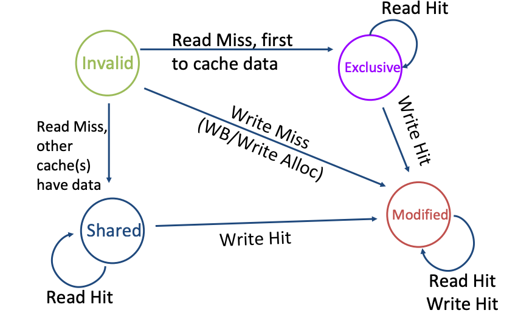
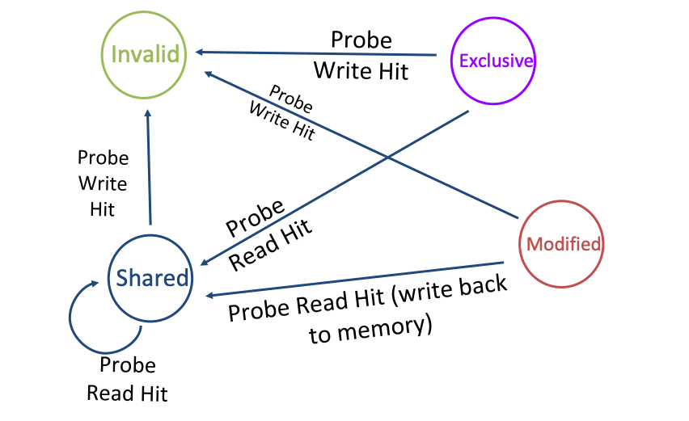

# 面試猜題

## 計算機結構
1. 什麼是 cpu pipeline ? 他會遇到什麼樣的 hazard ? hazard 怎麼樣避免和解決
2. 要怎麼樣提升 pipeline 的性能 ？
3. 什麼是亂數執行？
4. 什麼是分支預測？他需要什麼樣的模組？
5. 什麼是異常處理？異常分為幾種？在 risc-v 裡面是怎麼樣進行的？
6. 什麼是 context switch? 什麼是 callee safe register? caller safe register
7. 什麼是 cache? cache 又分為幾種？什麼是 cache coherence?
8. 什麼是虛擬記憶體？為什麼要用虛擬記憶體？什麼是 page fault ?
9. 什麼是 TLB?
10. 為什麼 cache 要考慮虛擬記憶體和實體記憶體？
11. 什麼是 memory barrier? 比較 arm riscv 的區別
12. 什麼是 DMA?
13. 處理器的效能計算方式是什麼？

### CPU pipeline
處理器在沒有 pipeline 的時候只能一個 cycle 執行一個指令，而這一個 cycle 時間非常的長，因為從取指、解碼、執行、存儲、寫回都要自己從頭包到尾。按照處理器的效能來看

效能公式：
$Performance = \frac{time}{Program} = \frac{Instructions}{Program}\cdot\frac{cycles}{instruction}\cdot\frac{Time}{Cycle}$

注意到這邊的定義：處理器的效能是看一個程式需要執行多少時間，其中這有三個影響的因素
- 每個 cycle 的時間是多少
- 每個 instruction 要花費多少個 cycle
- 每一個 program 需要多少 instruction


這三個我們必須想辦法降低，才可以提高處理器的效能

在沒有管線的時代，每一個 cycle 都要花費大量的時間，但是其實很多執行的時間是可以同步處理的，主流的處理器都將處理器分為五個階段

1. instruction fetch: 
    - 獲得 program counter。這個階段可能會處理分之預測
    - 獲得 instruction。從 icache 或是 itcm 中獲得指令
2. instruction decode
    - 將第一階段獲得的指令進行解碼。
4. execution
    - 執行解碼的指令。有的指令可能會超過一個 cycle，像是乘法和除法
6. load and store
    - 執行存取記憶體的動作，這個也有可能超過一個 cycle，會和 dcache 或是 dtcm 溝通
8. write back
    - 將結果寫回通用暫存器的通能

當你的處理器已經管線化之後，你會發現

$Performance = \frac{time}{Program} = \frac{Instructions}{Program}\cdot\frac{cycles}{instruction}\cdot\frac{Time}{Cycle}$

其實你只有降低 $\frac{Time}{Cycle}$ 而已，$\frac{cycles}{instruction}$ 仍然一樣

一個 cycle 執行一個或是少於一個，不會因為你有同步做前處理就增加，增加的策略下一節會說明

如果指令在管線之類衝突了怎麼辦：
1. structural hazard: 指令之間搶奪資源
    - 等 (降低 CPI)
    - 增加硬體
3. data hazard: 指令的執行會依據先前的運算結果
    - 分為三種情況
        - Read after Write (RAW): 真的有依賴關係
        - Write After Write (WAW): 可以靠暫存器重新命名解決
        - Write After Read (WAR): 可以靠暫存器重新命名解決
    - 遇到了 RAW 怎麼辦
        - 等
        - bypass: 提前將運算結果拿來用
        - speculate: 猜一個運算結果 (現在不常用)
5. control hazard: 下一個指令的執行會依據先前的運算結果
    - 兩種情況會遇到
    - 中斷發生了：遇到了管線全部清掉，讀取 interrupt handler 的 program counter
    - 分之預測指令：這個還有得猜，猜對了增加效能，猜錯了管線清掉，等等詳細說明

### 增進管線的效能
現行經典的 pipeline 缺點：
1. 定死的架構，導致有不必要的 stall 發生
2. CPI 的上限為 1
3. 高延遲的指令處理不好

怎麼改善
1. 處理器加深
    - 優點：每個 instruction 的 stage 變多了，可以分工更細、更適合需要多一點時間的指令
    - 缺點：bypass 的路徑和 control 路徑更難設計、功耗上升
3. 處理器加寬
    - 優點：每一個 cycle 可以同時處理更多指令, multi issue
    - 缺點：需要考慮 data dependency, RAW
5. 亂序執行
    - 將指令重新排列、反正程式設計師只管執行的結果對不對，亂序執行後有的處理器會將結果寫回 ROB (Reorder buffer)，透過 ROB 將結果寫回通用暫存器
7. 分支預測：請看下面的解析

### 分支預測 (Branch Prediction)

分之預測的指令不限於 `beq` `bne` 還有那種 `j` `jal` 不需要條件的那種

分支預測分為兩種：靜態分支預測、動態分支預測

靜態分支預測最經典的案例是：BTFN(Back Taken, Forward Not Taken)。因為往回跳的通常是 for 回圈，因此可以藉此加速。

動態分支預測是根據歷史訊息進行跳轉，最經典的案例是利用兩個 bit 決定要不要進行預測：

```
strong taken, taken, not taken, strong not taken
```

這種方式對於預測一行分之預測的指令很有效，但是如果有很多需要預測的指令的話指令結果會互相衝擊，因此需要一張分支預測表 (Pattern History Table, PHT) 來進行預測。而這張表的索引可以拿 program counter 中間的 n 個 bit。

然後對於分支預測的指令僅僅預測它的結果是不夠的，因為指令跳轉的目的地常常需要指令被執行完才知道結果，例如有些指令的跳轉結果是根據 `register base + offset` 因此僅知道結果無法有效地進行加速

Branch Target Buffer 分支預測緩衝區就可以用來保存最近執行過的分之預測 program counter 和他的跳轉目的地。只是它的容量常常不夠大，此外 BTB 記得時候是使用基底位址暫存器計算的，因此有可能存放的指令不是這次的目標位置。

RAS, Return address stack 用來儲存函數的回傳位置，當函數被呼叫的時候 (使用 `jal` `jalr` 指令) 會把當前的 program counter + 4 或是 2 存到 RAS 中，等到他跳回來的時候就可以 pop 出來

## risc-v 的異常處理
處理器在執行指令的時候如果突然有中斷請求的話，像是鍵盤按個鍵之類的，處理器就會中斷目前執行的指令跑過來處理中斷，等中斷執行完之後再回去執行原本的位置

如果有很多個中斷發起請求，處理器就會按照優先順序進行處理。risc-v 不支援巢狀中斷，中斷內不能有中斷。

中斷通常是外部的裝置造成的，異常是處理器內的事情，像是 page fault

中斷發生的流程，以 risc-v 舉例：
1. 將目前的 program counter 存到 mepc, machine exception program counter, 等到異常結束之後處理器會從 mepc 的 pc 開始執行
2. 尋找 handler, 使用 mtvec, machine trap-vector base address 尋找 handler 的位置，這個暫存器有兩個模式， 0 是將所有異常都跳到 base address, 1 是將異常跳到對應的異常 handler
3. 進入異常的時候 mcause 會同時更新，mcause 的地 31 bit 是 interrupt(1)/exception(0)，剩下就是原因
4. 更新 mtval, machine trap value 可能會將記憶體的存取位置或是指令編碼存進去
5. 更新 mstatus 會將 mie, machine interrupt enable 這個 bit 關掉，關掉之後將 mpie machine previous interrupt enable 設置成 1
6. 退出異常，將 mpie 的值回歸到 mie ，處理器回到 mepc 的位址繼續執行


中斷的類型：優先順序如這邊的介紹順序
1. 外部中斷：外面的硬體造成的
2. timer 中斷
3. 軟體中斷：讓你做 system call 用的

### Context switch 怎麼做
先複習什麼是 callee save register
用之前要先把先前的直存起來，用完之後要復原的：s0-s11, sp

context switch 就是要將這一類的暫存器放到記憶體中，將任務A的暫存氣其放到記憶體中，讀取任務B的記憶體暫存器存放的位置，將他的資料一個一個復原。

做 context switch 的時機：scheduling, interrupt, exception

### Virtual Memory
為什麼要用虛擬記憶體？
1. 增加使用效率：避免記憶體碎片化
2. 降低開發者的維護成本：每個行程都相當于有整個記憶體可以用
3. 更安全：記憶體不會踩到其他行程的資料

為了避免換個任務就把整個記憶體空間換掉，這樣效率太差，可以利用 page 的方式，只換一塊，(一塊通常都用 4 kB 因為 flash 的 page 也是 4kB 當然也可以配置)，這樣效率也比較好

當然在硬碟中的 virtual memory 會利用 mmu 的 page table 找到對應的 physical memory。

程式也可以在虛擬記憶體中進行分配和存取，只是當這些記憶體要被存取或修改的時候整個 page 才會被分到物理頁面 physical page這個動作叫做請求或是 page fault, page table 放在主記憶體

以一個 page 為 4kb 為例，4 GB 的實體記憶體需要的 page table 要 1Mb 而一個地址是 4 byte 因此整個 page table 需要 4MB。在 arm 中，page table 被存到 TTBRx 中。

虛擬記憶體會把自己的 virtual page number 作為 index 找到對應的 page table entry 並且檢查是否為 valid bit，如果有效就可以拿到 physical page number

但是 4MB 實在太浪費記憶體了，因此我們使用多級 page table，在第一級 page table 放第二級 page table 的地址，以此類推以降低記憶體的使用。

MMU 包含兩個單元：table walk unit, translation lookaside buffer
- table walk unit 是用來建立 page table 的
- tlb 是加速 va 轉成 pa 的 cache，如果 cache miss 就去查 page table (twu)

### Cache
原因：處理器存取記憶體的時間太久，中間需要小抄。

一般快取是放在處理器裡面的 SRAM，容量較小成本較高。就是因為容量小才比較快。如果處理器在存取快取時有資料，就會直接拿快取的資料用 cache hit 如果沒有的話就會讓 cache 回去記憶體拿 cache miss

Cache 的工作原理
以 VIPT, (virtual index physical tag) 為例。處理器在存取 virtual memory 的時候會同時把資料給 tlb 和 cache

tlb:
- 如果 tlb miss 則處理器查詢 page table
- 如果 tlb hit 就得到 read page number 並得到物理地址

cache:
檢查 cache 的 index bit 找到對應的 set 並且比較 tag bit 和 valid bit 如果命中則拿到資料，沒命中則去記憶體拿資料

三種 cache 的映射方式
- fully associate
    - 沒有 index, 尋找很麻煩, 需要看每一個 cache line 有沒有重複的 tag
- set assiciate
    - 有 index，目前最常用的策略，可以避免抖動的情況發生。但是刻意的抖動還是無法避免
- direct mapping (set = 1)
    - 有 index 也有不同的換 cache 策略，但是有可能會抖動，有些 cache line 永遠用不到

cache 寫入的策略
- write through: 寫進快取的同時也寫進記憶體
- write back: 需要 dirty bit, 資料先寫道快取，等到快取要被替換的時候一次寫回記憶體
- write allocate：在 cache write miss 之後把整個 block 帶回 cache line
- non-write allocate 

> 通常 write allocate + write back

### virtual cache and physical cache
處理器在處理記憶體的時候適用virtual address，經過 tlb 和 mmu 之後可以轉換成 physical address。 tlb 只會用來加速 va 到 pa 的過程。得到 pa 之後每次都從實體記憶體讀資料會很慢，因為直接讀取記憶體很慢也才有了 cache

那，查詢 cache 的時候適用 va 還時 pa 呢？
1. PIPT, physical index physical tag
    - 這會導致，看個 cache 也要把 tlb 和 mmu 同時找完，太慢了
3. VIVT, virtual index virtula tag
    - 名稱重複問題，不同 virtual index 或是 virtual tag 會對應同一個的實體記憶體
5. VIPT, virtual index physical tag
    - 名稱重複問題，不同 virtual index 會對定同一個的實體記憶體

VIVT 是不能徹底解決的，但是 VIPT 是可以的

先看一下 aliasing 名稱重複是什麼？
- 就是多個不同的虛擬記憶體會對應到同一個實體記憶體
- VIVT 因為 index 和 tag 都是變因不好控制所以放棄
- VIPT 可以將多個虛擬位置的 index 相同將他們和 offet 重疊

```
31                   12     5      0
|<----- 20 bits ---->|<- 12 bits ->|
|<--- page frame --->| page offset |
[       TAG          |index |offset]
```

名稱相同問題則是相反
- 多個相同的虛擬記憶體位置對應到不同的實體記憶體 
- 發生在 context switch 新的 task 用到舊的 tlb
- 解決方法：每次換任務的時候都把 tlb flush 掉
    - 但是這樣效能太差，換個任務相當於重開機
    - 因此每一個 user space process 都有自己的 tlb, 用 address space id (asid) 管理
    - 還有另外一個是共用的 tlb

### Cache Coherence
為什麼需要 cache coherence?
在多核心中，每個處理器可能會有自己的 l1 cache 但是和其他核心共用一個 l2 cache

這時候為了要保證每個看得到記憶體的人，包含 dma 看到的資料都是一樣的就有了這個協定

這邊介紹 MESI 協定：
一開始大家都是 i(invalid)

當 p0 想要寫 data 的時候發生 write miss, 就會變成 modified

當 p1 想要讀 data 發生 read miss 而其他人又沒有這個 data, p1 變成 exclusive

當 p2 想要讀 data 的時候發現別人有這個 data exlusice modified 都變成 share

當 p0 把資料寫進 cache 的時候，其他人的資料都變成 invalid




### Memory Barrier
在 arm 的處理器架構中分為三種：
- dmb, data memory barrier, 只會管 load store, cache invalidate 等等的指令不可以重排到這個之前
- dsb, data synchronization barrier，每個指令都不可以重排到他之前
- isb, instruction synchronization barrier，把他之後的 pipeline 洗掉，處理器重新獲取

在 risc-v 只有 fence 主要對應 arm 的 dsb

### DMA
Direct memory access, 另外一個 bus master, 可以用來搬運資料用的，這時候就不需要處理器花費額外的時間處理，但是他也會用到 bus 的頻寬。

## 分析 [biriscv](https://github.com/ultraembedded/biriscv)


### Program Counter


### Instruction Fetch

### Instruction Decode

### Issue

### Execution stage 1

### Execution stage 2

### Write back