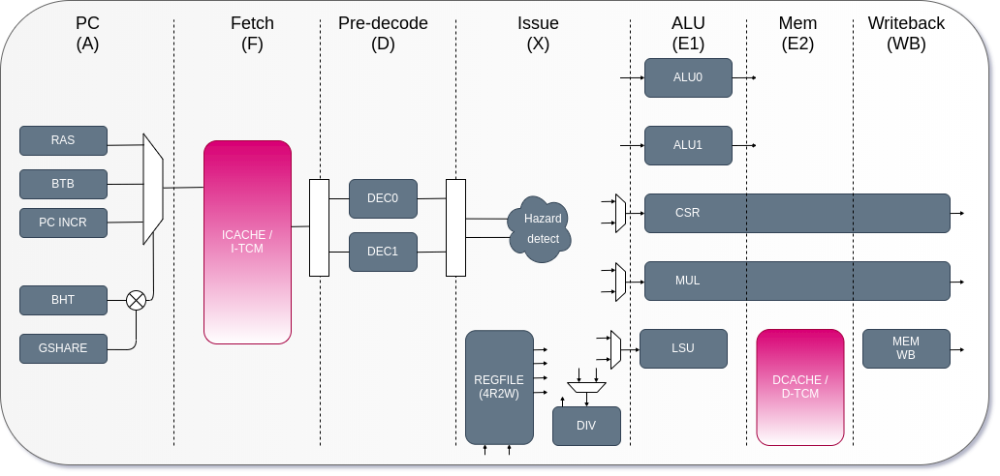

# 面試猜題

## 計算機結構
1. 什麼是 cpu pipeline ? 他會遇到什麼樣的 hazard ? hazard 怎麼樣避免和解決
2. 要怎麼樣提升 pipeline 的性能 ？
3. 什麼是亂數執行？
4. 什麼是分支預測？他需要什麼樣的模組？
5. 什麼是異常處理？異常分為幾種？在 risc-v 裡面是怎麼樣進行的？
6. 什麼是 context switch? 什麼是 callee safe register? caller safe register
7. 什麼是 cache? cache 又分為幾種？什麼是 cache coherence?
8. 什麼是虛擬記憶體？為什麼要用虛擬記憶體？什麼是 page fault ?
9. 什麼是 TLB?
10. 為什麼 cache 要考慮虛擬記憶體和實體記憶體？
11. 什麼是 memory barrier? 比較 arm riscv 的區別
12. 什麼是 DMA?
13. 處理器的效能計算方式是什麼？

### CPU pipeline
處理器在沒有 pipeline 的時候只能一個 cycle 執行一個指令，而這一個 cycle 時間非常的長，因為從取指、解碼、執行、存儲、寫回都要自己從頭包到尾。按照處理器的效能來看

效能公式：
$Performance = \frac{time}{Program} = \frac{Instructions}{Program}\cdot\frac{cycles}{instruction}\cdot\frac{Time}{Cycle}$

注意到這邊的定義：處理器的效能是看一個程式需要執行多少時間，其中這有三個影響的因素
- 每個 cycle 的時間是多少
- 每個 instruction 要花費多少個 cycle
- 每一個 program 需要多少 instruction


這三個我們必須想辦法降低，才可以提高處理器的效能

在沒有管線的時代，每一個 cycle 都要花費大量的時間，但是其實很多執行的時間是可以同步處理的，主流的處理器都將處理器分為五個階段

1. instruction fetch: 
    - 獲得 program counter。這個階段可能會處理分之預測
    - 獲得 instruction。從 icache 或是 itcm 中獲得指令
2. instruction decode
    - 將第一階段獲得的指令進行解碼。
4. execution
    - 執行解碼的指令。有的指令可能會超過一個 cycle，像是乘法和除法
6. load and store
    - 執行存取記憶體的動作，這個也有可能超過一個 cycle，會和 dcache 或是 dtcm 溝通
8. write back
    - 將結果寫回通用暫存器的通能

當你的處理器已經管線化之後，你會發現

$Performance = \frac{time}{Program} = \frac{Instructions}{Program}\cdot\frac{cycles}{instruction}\cdot\frac{Time}{Cycle}$

其實你只有降低 $\frac{Time}{Cycle}$ 而已，$\frac{cycles}{instruction}$ 仍然一樣

一個 cycle 執行一個或是少於一個，不會因為你有同步做前處理就增加，增加的策略下一節會說明

如果指令在管線之類衝突了怎麼辦：
1. structural hazard: 指令之間搶奪資源
    - 等 (降低 CPI)
    - 增加硬體
3. data hazard: 指令的執行會依據先前的運算結果
    - 分為三種情況
        - Read after Write (RAW): 真的有依賴關係
        - Write After Write (WAW): 可以靠暫存器重新命名解決
        - Write After Read (WAR): 可以靠暫存器重新命名解決
    - 遇到了 RAW 怎麼辦
        - 等
        - bypass: 提前將運算結果拿來用
        - speculate: 猜一個運算結果 (現在不常用)
5. control hazard: 下一個指令的執行會依據先前的運算結果
    - 兩種情況會遇到
    - 中斷發生了：遇到了管線全部清掉，讀取 interrupt handler 的 program counter
    - 分之預測指令：這個還有得猜，猜對了增加效能，猜錯了管線清掉，等等詳細說明

### 增進管線的效能
現行經典的 pipeline 缺點：
1. 定死的架構，導致有不必要的 stall 發生
2. CPI 的上限為 1
3. 高延遲的指令處理不好

怎麼改善
1. 處理器加深
    - 優點：每個 instruction 的 stage 變多了，可以分工更細、更適合需要多一點時間的指令
    - 缺點：bypass 的路徑和 control 路徑更難設計、功耗上升
3. 處理器加寬
    - 優點：每一個 cycle 可以同時處理更多指令, multi issue
    - 缺點：需要考慮 data dependency, RAW
5. 亂序執行
    - 將指令重新排列、反正程式設計師只管執行的結果對不對，亂序執行後有的處理器會將結果寫回 ROB (Reorder buffer)，透過 ROB 將結果寫回通用暫存器
7. 分支預測：請看下面的解析

### 分支預測 (Branch Prediction)

分之預測的指令不限於 `beq` `bne` 還有那種 `j` `jal` 不需要條件的那種

分支預測分為兩種：靜態分支預測、動態分支預測

靜態分支預測最經典的案例是：BTFN(Back Taken, Forward Not Taken)。因為往回跳的通常是 for 回圈，因此可以藉此加速。

動態分支預測是根據歷史訊息進行跳轉，最經典的案例是利用兩個 bit 決定要不要進行預測：

```
strong taken, taken, not taken, strong not taken
```

這種方式對於預測一行分之預測的指令很有效，但是如果有很多需要預測的指令的話指令結果會互相衝擊，因此需要一張分支預測表 (Pattern History Table, PHT) 來進行預測。而這張表的索引可以拿 program counter 中間的 n 個 bit。

然後對於分支預測的指令僅僅預測它的結果是不夠的，因為指令跳轉的目的地常常需要指令被執行完才知道結果，例如有些指令的跳轉結果是根據 `register base + offset` 因此僅知道結果無法有效地進行加速

Branch Target Buffer 分支預測緩衝區就可以用來保存最近執行過的分之預測 program counter 和他的跳轉目的地。只是它的容量常常不夠大，此外 BTB 記得時候是使用基底位址暫存器計算的，因此有可能存放的指令不是這次的目標位置。

RAS, Return address stack 用來儲存函數的回傳位置，當函數被呼叫的時候 (使用 `jal` `jalr` 指令) 會把當前的 program counter + 4 或是 2 存到 RAS 中，等到他跳回來的時候就可以 pop 出來

## risc-v 的異常處理
處理器在執行指令的時候如果突然有中斷請求的話，像是鍵盤按個鍵之類的，處理器就會中斷目前執行的指令跑過來處理中斷，等中斷執行完之後再回去執行原本的位置

如果有很多個中斷發起請求，處理器就會按照優先順序進行處理。risc-v 不支援巢狀中斷，中斷內不能有中斷。

中斷通常是外部的裝置造成的，異常是處理器內的事情，像是 page fault

中斷發生的流程，以 risc-v 舉例：
1. 將目前的 program counter 存到 mepc, machine exception program counter, 等到異常結束之後處理器會從 mepc 的 pc 開始執行
2. 尋找 handler, 使用 mtvec, machine trap-vector base address 尋找 handler 的位置，這個暫存器有兩個模式， 0 是將所有異常都跳到 base address, 1 是將異常跳到對應的異常 handler
3. 進入異常的時候 mcause 會同時更新，mcause 的地 31 bit 是 interrupt(1)/exception(0)，剩下就是原因
4. 更新 mtval, machine trap value 可能會將記憶體的存取位置或是指令編碼存進去
5. 更新 mstatus 會將 mie, machine interrupt enable 這個 bit 關掉，關掉之後將 mpie machine previous interrupt enable 設置成 1
6. 退出異常，將 mpie 的值回歸到 mie ，處理器回到 mepc 的位址繼續執行


中斷的類型：優先順序如這邊的介紹順序
1. 外部中斷：外面的硬體造成的
2. timer 中斷
3. 軟體中斷：讓你做 system call 用的

### Context switch 怎麼做
先複習什麼是 callee save register
用之前要先把先前的直存起來，用完之後要復原的：s0-s11, sp

context switch 就是要將這一類的暫存器放到記憶體中，將任務A的暫存氣其放到記憶體中，讀取任務B的記憶體暫存器存放的位置，將他的資料一個一個復原。

做 context switch 的時機：scheduling, interrupt, exception

### Virtual Memory
為什麼要用虛擬記憶體？
1. 增加使用效率：避免記憶體碎片化
2. 降低開發者的維護成本：每個行程都相當于有整個記憶體可以用
3. 更安全：記憶體不會踩到其他行程的資料

為了避免換個任務就把整個記憶體空間換掉，這樣效率太差，可以利用 page 的方式，只換一塊，(一塊通常都用 4 kB 因為 flash 的 page 也是 4kB 當然也可以配置)，這樣效率也比較好

當然在硬碟中的 virtual memory 會利用 mmu 的 page table 找到對應的 physical memory。

程式也可以在虛擬記憶體中進行分配和存取，只是當這些記憶體要被存取或修改的時候整個 page 才會被分到物理頁面 physical page這個動作叫做請求或是 page fault, page table 放在主記憶體

以一個 page 為 4kb 為例，4 GB 的實體記憶體需要的 page table 要 1Mb 而一個地址是 4 byte 因此整個 page table 需要 4MB。在 arm 中，page table 被存到 TTBRx 中。

虛擬記憶體會把自己的 virtual page number 作為 index 找到對應的 page table entry 並且檢查是否為 valid bit，如果有效就可以拿到 physical page number

但是 4MB 實在太浪費記憶體了，因此我們使用多級 page table，在第一級 page table 放第二級 page table 的地址，以此類推以降低記憶體的使用。

MMU 包含兩個單元：table walk unit, translation lookaside buffer
- table walk unit 是用來建立 page table 的
- tlb 是加速 va 轉成 pa 的 cache，如果 cache miss 就去查 page table (twu)

### Cache
原因：處理器存取記憶體的時間太久，中間需要小抄。

一般快取是放在處理器裡面的 SRAM，容量較小成本較高。就是因為容量小才比較快。如果處理器在存取快取時有資料，就會直接拿快取的資料用 cache hit 如果沒有的話就會讓 cache 回去記憶體拿 cache miss

Cache 的工作原理
以 VIPT, (virtual index physical tag) 為例。處理器在存取 virtual memory 的時候會同時把資料給 tlb 和 cache

tlb:
- 如果 tlb miss 則處理器查詢 page table
- 如果 tlb hit 就得到 read page number 並得到物理地址

cache:
檢查 cache 的 index bit 找到對應的 set 並且比較 tag bit 和 valid bit 如果命中則拿到資料，沒命中則去記憶體拿資料

三種 cache 的映射方式
- fully associate
    - 沒有 index, 尋找很麻煩, 需要看每一個 cache line 有沒有重複的 tag
- set assiciate
    - 有 index，目前最常用的策略，可以避免抖動的情況發生。但是刻意的抖動還是無法避免
- direct mapping (set = 1)
    - 有 index 也有不同的換 cache 策略，但是有可能會抖動，有些 cache line 永遠用不到

cache 寫入的策略
- write through: 寫進快取的同時也寫進記憶體
- write back: 需要 dirty bit, 資料先寫道快取，等到快取要被替換的時候一次寫回記憶體
- write allocate：在 cache write miss 之後把整個 block 帶回 cache line
- non-write allocate 

> 通常 write allocate + write back

### virtual cache and physical cache
處理器在處理記憶體的時候適用virtual address，經過 tlb 和 mmu 之後可以轉換成 physical address。 tlb 只會用來加速 va 到 pa 的過程。得到 pa 之後每次都從實體記憶體讀資料會很慢，因為直接讀取記憶體很慢也才有了 cache

那，查詢 cache 的時候適用 va 還時 pa 呢？
1. PIPT, physical index physical tag
    - 這會導致，看個 cache 也要把 tlb 和 mmu 同時找完，太慢了
3. VIVT, virtual index virtula tag
    - 名稱重複問題，不同 virtual index 或是 virtual tag 會對應同一個的實體記憶體
5. VIPT, virtual index physical tag
    - 名稱重複問題，不同 virtual index 會對定同一個的實體記憶體

VIVT 是不能徹底解決的，但是 VIPT 是可以的

先看一下 aliasing 名稱重複是什麼？
- 就是多個不同的虛擬記憶體會對應到同一個實體記憶體
- VIVT 因為 index 和 tag 都是變因不好控制所以放棄
- VIPT 可以將多個虛擬位置的 index 相同將他們和 offet 重疊

```
31                   12     5      0
|<----- 20 bits ---->|<- 12 bits ->|
|<--- page frame --->| page offset |
[       TAG          |index |offset]
```

名稱相同問題則是相反
- 多個相同的虛擬記憶體位置對應到不同的實體記憶體 
- 發生在 context switch 新的 task 用到舊的 tlb
- 解決方法：每次換任務的時候都把 tlb flush 掉
    - 但是這樣效能太差，換個任務相當於重開機
    - 因此每一個 user space process 都有自己的 tlb, 用 address space id (asid) 管理
    - 還有另外一個是共用的 tlb

### Cache Coherence
為什麼需要 cache coherence?
在多核心中，每個處理器可能會有自己的 l1 cache 但是和其他核心共用一個 l2 cache

這時候為了要保證每個看得到記憶體的人，包含 dma 看到的資料都是一樣的就有了這個協定

這邊介紹 MESI 協定：
一開始大家都是 i(invalid)

當 p0 想要寫 data 的時候發生 write miss, 就會變成 modified

當 p1 想要讀 data 發生 read miss 而其他人又沒有這個 data, p1 變成 exclusive

當 p2 想要讀 data 的時候發現別人有這個 data exlusice modified 都變成 share

當 p0 把資料寫進 cache 的時候，其他人的資料都變成 invalid


### Memory Barrier
在 arm 的處理器架構中分為三種：
- dmb, data memory barrier, 只會管 load store, cache invalidate 等等的指令不可以重排到這個之前
- dsb, data synchronization barrier，每個指令都不可以重排到他之前
- isb, instruction synchronization barrier，把他之後的 pipeline 洗掉，處理器重新獲取

在 risc-v 只有 fence 主要對應 arm 的 dsb

### DMA
Direct memory access, 另外一個 bus master, 可以用來搬運資料用的，這時候就不需要處理器花費額外的時間處理，但是他也會用到 bus 的頻寬。

## 分析 [biriscv](https://github.com/ultraembedded/biriscv)


### Program Counter
這個階段 CPU 是用來獲取 program counter 的，在 biRISC-V 中可以利用

```verilog
parameter SUPPORT_BRANCH_PREDICTION = 1
```

決定是否使用分支預測，如果不使用分支預測的話，獲取到的指令永遠是 `program counter + 8`
```verilog
begin: NO_BRANCH_PREDICTION

assign next_pc_f_o    = {pc_f_i[31:3],3'b0} + 32'd8;
assign next_taken_f_o = 2'b0;

end
```

接下來我們看一下分支預測會做什麼事吧，首先需要將分之預測分為兩種：
1. 有條件的跳，例如：`bne`, `beq`，`BHT, BTB` 管分支預測
2. 沒有條件的跳，例如：`jal`, `jalr`，`RAS` 只管函數跳轉 (function call, return)

#### RAS (Return Address Stack)
RAS 主要用在非條件的跳轉，例如函式、回傳值等等，例如：
```verilog
always @ *
begin
    ras_index_real_r = ras_index_real_q;

    if (branch_request_i & branch_is_call_i)
        ras_index_real_r = ras_index_real_q + 1;
    else if (branch_request_i & branch_is_ret_i)
        ras_index_real_r = ras_index_real_q - 1;
end
```
只要是函式跳轉則 `index + 1` 如果是回傳則 `index - 1`
```c++
// On a call push return address onto RAS stack (current PC + 4)
else if (branch_request_i & branch_is_call_i)
begin
    ras_stack_q[ras_index_r] <= branch_source_i + 32'd4;
    ras_index_q              <= ras_index_r;
end
// On a call push return address onto RAS stack (current PC + 4)
else if (ras_call_pred_w & pc_accept_i)
begin
    ras_stack_q[ras_index_r] <= (btb_upper_w ? (pc_f_i | 32'd4) : pc_f_i) + 32'd4;
    ras_index_q              <= ras_index_r;
end
// Return - pop item from stack
else if ((ras_ret_pred_w & pc_accept_i) || (branch_request_i & branch_is_ret_i))
begin
    ras_index_q              <= ras_index_r;
end
```
上面這段程式碼則會針對有沒有進行分支預測、分支預測的結果決定是否要儲存 `program counter`

#### GSHARE
Gshare 使用的是全域的分之預測結果，可以用下面這個 flag 進行開關
```verilog
parameter GSHARE_ENABLE    = 0
```

如果這個 flag 有開的話 BHT 會優先使用 gshare 的預測結果
```verilog
reg [1:0]                    bht_sat_q[NUM_BHT_ENTRIES-1:0];

wire [NUM_BHT_ENTRIES_W-1:0] bht_wr_entry_w = GSHARE_ENABLE ? gshare_wr_entry_w : branch_source_i[2+NUM_BHT_ENTRIES_W-1:2];
wire [NUM_BHT_ENTRIES_W-1:0] bht_rd_entry_w = GSHARE_ENABLE ? gshare_rd_entry_w : {pc_f_i[3+NUM_BHT_ENTRIES_W-2:3],btb_upper_w};
```

gshare 的算法是使用 program counter 的一部分和全域歷史緩衝區進行互斥運算得到 predict table 的索引
```verilog
wire [NUM_BHT_ENTRIES_W-1:0] gshare_wr_entry_w = (branch_request_i ? global_history_real_q : global_history_q) ^ branch_source_i[2+NUM_BHT_ENTRIES_W-1:2];
wire [NUM_BHT_ENTRIES_W-1:0] gshare_rd_entry_w = global_history_q ^ {pc_f_i[3+NUM_BHT_ENTRIES_W-2:3],btb_upper_w};
```

#### BHT (Branch History Table)
上面講到，在 biriscv 中如果選用了 gshare 就不會用 bht 的結果，bht 也是利用 program counter 的一部分當作索引

這些索引都會找到
```verilog
reg [1:0] bht_sat_q[NUM_BHT_ENTRIES-1:0];
```

這邊的分支預測方式是利用 2 bit 當作 branch taken 或是 branch not taken 的根據
```txt
3: strong taken
2: taken
1: not taken
0: strong not taken
```
我們可以看到 source code 也是這樣撰寫的
```verilog
else if (branch_is_taken_i && bht_sat_q[bht_wr_entry_w] < 2'd3)
    bht_sat_q[bht_wr_entry_w] <= bht_sat_q[bht_wr_entry_w] + 2'd1;
else if (branch_is_not_taken_i && bht_sat_q[bht_wr_entry_w] > 2'd0)
    bht_sat_q[bht_wr_entry_w] <= bht_sat_q[bht_wr_entry_w] - 2'd1;
```

#### BTB (Branch Target Buffer)
利用 program counter 儲存他們的跳躍目標位置
```verilog
reg [31:0]  btb_pc_q[NUM_BTB_ENTRIES-1:0];
reg [31:0]  btb_target_q[NUM_BTB_ENTRIES-1:0];
```

如果分之預測到 branch hit 的話，更新 branch target program counter
```verilog
// Hit - update entry
else if (btb_hit_r)
begin
    btb_pc_q[btb_wr_entry_r]     <= branch_source_i;
    if (branch_is_taken_i)
        btb_target_q[btb_wr_entry_r] <= branch_pc_i;
    btb_is_call_q[btb_wr_entry_r]<= branch_is_call_i;
    btb_is_ret_q[btb_wr_entry_r] <= branch_is_ret_i;
    btb_is_jmp_q[btb_wr_entry_r] <= branch_is_jmp_i;
end
```
如果沒有預測到的話，需要把一個 index 的值換掉
```verilog
// Miss - allocate entry
else if (btb_miss_r)
begin
    btb_pc_q[btb_wr_alloc_w]     <= branch_source_i;
    btb_target_q[btb_wr_alloc_w] <= branch_pc_i;
    btb_is_call_q[btb_wr_alloc_w]<= branch_is_call_i;
    btb_is_ret_q[btb_wr_alloc_w] <= branch_is_ret_i;
    btb_is_jmp_q[btb_wr_alloc_w] <= branch_is_jmp_i;
end
```

替換的策略會使用 lfsr 進行
```verilog
biriscv_npc_lfsr
#(
    .DEPTH(NUM_BTB_ENTRIES)
   ,.ADDR_W(NUM_BTB_ENTRIES_W)
)
u_lru
(
     .clk_i(clk_i)
    ,.rst_i(rst_i)

    ,.hit_i(btb_valid_r)
    ,.hit_entry_i(btb_entry_r)

    ,.alloc_i(btb_miss_r)
    ,.alloc_entry_o(btb_wr_alloc_w)
);
```

lfsr 替換的策略是將 program counter 去互斥一個值得到 index
```verilog
always @ (posedge clk_i or posedge rst_i)
if (rst_i)
    lfsr_q <= INITIAL_VALUE;
else if (alloc_i)
begin
    if (lfsr_q[0])
        lfsr_q <= {1'b0, lfsr_q[15:1]} ^ TAP_VALUE;
    else
        lfsr_q <= {1'b0, lfsr_q[15:1]};
end

assign alloc_entry_o = lfsr_q[ADDR_W-1:0];
```

### Instruction Fetch
instruction fetch stage 裡面做的事有幾個：
1. 從 icache 中撈指令
2. 當分支跳轉的時候要更新 program counter 的值並且更新指令
3. 處理 icache 的讀取、失效和刷新
4. 檢測並提取指令過程中的錯誤

當然，我們必須考慮到 mmu 的情況
```verilog
// riscv_core.v
u_frontend
(
    // Inputs
     .clk_i(clk_i)
    ,.rst_i(rst_i)
    ,.icache_accept_i(mmu_ifetch_accept_w)
    ,.icache_valid_i(mmu_ifetch_valid_w)
    ,.icache_error_i(mmu_ifetch_error_w)
    ,.icache_inst_i(mmu_ifetch_inst_w)
...
);

...
biriscv_mmu
#(
     .MEM_CACHE_ADDR_MAX(MEM_CACHE_ADDR_MAX)
    ,.SUPPORT_MMU(SUPPORT_MMU)
    ,.MEM_CACHE_ADDR_MIN(MEM_CACHE_ADDR_MIN)
)
u_mmu
    // Outputs
    ,.fetch_in_accept_o(mmu_ifetch_accept_w)
    ,.fetch_in_valid_o(mmu_ifetch_valid_w)
    ,.fetch_in_error_o(mmu_ifetch_error_w)
    ,.fetch_in_inst_o(mmu_ifetch_inst_w)
```
#### instruction fetch


#### mmu 的運作方式
如果沒有 mmu 的話，則 mmu 的 output = input

mmu 主要的作用就是將 virtual address 轉乘 physical address，其中包含兩個主要的元件：
1. translation walk unit (twu)
2. translation lookaside buffer (tlb)

twu 是用來走訪 page table 的，而 tlb 是用來加速 virtual address 和 physical address 的轉換。

先從基本的開始說起 satp, Supervisor Address Translation and Protection 總共有三個 field:
1. mode: 1: Page-based 32-bit virtual addressing, 0: no translation
2. asid: address space id
3. ppn: 紀錄 page table 的 physical page number

```verilog
// Global enable
wire        vm_enable_w = satp_i[`SATP_MODE_R];
wire [31:0] ptbr_w      = {satp_i[`SATP_PPN_R], 12'b0};
```
可以看到 `vm_enable_w` 就是用來看 `satp_i` 的第 31 bit，而 page table 的記憶體實體位置由 ptbr_w 定義。page table 有多個級別，可以通過一級一級的查詢找到對應的 page table entry

而 twu 也是使用 `ptbr_w` 開始 page table 的走訪
```verilog
// TLB miss, walk page table
if (state_q == STATE_IDLE && (itlb_miss_w || dtlb_miss_w))
begin
    pte_addr_q  <= ptbr_w + {20'b0, request_addr_w[31:22], 2'b0};
    virt_addr_q <= request_addr_w;
    dtlb_req_q  <= dtlb_miss_w;

    state_q     <= STATE_LEVEL_FIRST;
end
// First level (4MB superpage)
else if (state_q == STATE_LEVEL_FIRST && resp_valid_w)
begin
    // Error or page not present
    if (resp_error_w || !resp_data_w[`PAGE_PRESENT])
    begin
        pte_entry_q <= 32'b0;
        state_q     <= STATE_UPDATE;
    end
    // Valid entry, but another level to fetch
    else if (!(resp_data_w[`PAGE_READ] || resp_data_w[`PAGE_WRITE] || resp_data_w[`PAGE_EXEC]))
    begin
        pte_addr_q  <= {resp_data_w[29:10], 12'b0} + {20'b0, request_addr_w[21:12], 2'b0};
        state_q     <= STATE_LEVEL_SECOND;
    end
    // Valid entry, actual valid PTE
    else
    begin
        pte_entry_q <= ((pte_ppn_w | {22'b0, request_addr_w[21:12]}) << `MMU_PGSHIFT) | {22'b0, pte_flags_w};
        state_q     <= STATE_UPDATE;
    end
end
// Second level (4KB page)
else if (state_q == STATE_LEVEL_SECOND && resp_valid_w)
begin
    // Valid entry, final level
    if (resp_data_w[`PAGE_PRESENT])
    begin
        pte_entry_q <= (pte_ppn_w << `MMU_PGSHIFT) | {22'b0, pte_flags_w};
        state_q     <= STATE_UPDATE;
    end
    // Page fault
    else
    begin
        pte_entry_q <= 32'b0;
        state_q     <= STATE_UPDATE;
    end
end
else if (state_q == STATE_UPDATE)
begin
    state_q    <= STATE_IDLE;
end
```
假設 tlb miss 就會開始走訪 page table，一開始會先獲取 page table 的基底位置之後開始走訪第一級的 page table 和第二級的 page table

在 mmu 裡面有兩個 tlb, itlb 和 dtlb。當一個虛擬地址在 tlb 找到對應的 physical address 的時候就會發生 tlb hit 不然會發生 tlb miss，發生 tlb miss 的時候 twu 就開始出動

#### icache 的運作方式
biriscv 實作 16kByte 的 icache，使用 2 way associate 的方式，也就是每一個 set 都是 8kB，總共有 256 個 cache line 每一個 cache line 為 32 byte

```verilog
// cache line 的 index
localparam ICACHE_NUM_LINES          = 256;
localparam ICACHE_LINE_ADDR_W        = 8;

// 每一個 cache line 的 sizw
localparam ICACHE_LINE_SIZE_W        = 5;
localparam ICACHE_LINE_SIZE          = 32;
```

icache 總共有六個部分：
1. icache address 分解
2. icache lookup
3. cache hit
4. cache miss
5. replacement policy
6. status

##### address 分解
```verilog
// Tag addressing and match value, find cache line
wire [ICACHE_TAG_REQ_LINE_W-1:0] req_line_addr_w  = req_pc_i[`ICACHE_TAG_REQ_RNG];

// compare tag address
wire [ICACHE_TAG_CMP_ADDR_W-1:0] req_pc_tag_cmp_w = lookup_addr_q[`ICACHE_TAG_CMP_ADDR_RNG];
```

檢查 valid bit 和 tag 是否有效
```verilog
icache_tag_ram
u_tag1
(
  .clk_i(clk_i),
  .rst_i(rst_i),
  .addr_i(tag_addr_r),
  .data_i(tag_data_in_r),
  .wr_i(tag1_write_r),
  .data_o(tag1_data_out_w)
);

wire                           tag1_valid_w     = tag1_data_out_w[CACHE_TAG_VALID_BIT];
wire [CACHE_TAG_ADDR_BITS-1:0] tag1_addr_bits_w = tag1_data_out_w[`CACHE_TAG_ADDR_RNG];

// Tag hit?
wire                           tag1_hit_w = tag1_valid_w ? (tag1_addr_bits_w == req_pc_tag_cmp_w) : 1'b0;
```

##### 狀態機
```verilog
localparam STATE_FLUSH       = 2'd0; // cache flush
localparam STATE_LOOKUP      = 2'd1; // cache hit?
localparam STATE_REFILL      = 2'd2; // cache miss, load data from ram
localparam STATE_RELOOKUP    = 2'd3; // load complete, re-lookup
```

狀態機的關係：
`STATE_FLUSH`
- 一開始的狀態或收到刷新指令的時候就會變成 `STATE_FLUSH`
- 刷新完之後轉乘 `STATE_LOOKUP`

接下來看程式碼怎麼做的：
```verilog
reg tag1_write_r;
always @ *
begin
    tag1_write_r = 1'b0;

    // Cache flush
    if (state_q == STATE_FLUSH)
        tag1_write_r = 1'b1;
    // Line refill
    else if (state_q == STATE_REFILL)
        tag1_write_r = axi_rvalid_i && axi_rlast_i && (replace_way_q == 1);
end

// Tag RAM address
always @ *
begin
    tag_addr_r = flush_addr_q;

    // Cache flush
    if (state_q == STATE_FLUSH)
        tag_addr_r = flush_addr_q;
    // Line refill
    else if (state_q == STATE_REFILL || state_q == STATE_RELOOKUP)
        tag_addr_r = lookup_addr_q[`ICACHE_TAG_REQ_RNG];
    // Lookup
    else
        tag_addr_r = req_line_addr_w;
end
```

接下來就是把這些值丟到 `icache_tag_ram` 這個模組進行處理：
```
icache_tag_ram
u_tag1
(
  .clk_i(clk_i),
  .rst_i(rst_i),
  .addr_i(tag_addr_r),
  .data_i(tag_data_in_r),
  .wr_i(tag1_write_r),
  .data_o(tag1_data_out_w)
);
```

這裡會發現如果需要 flush 的話會把 `tag1_write_r` 的值填 1 之後 `icache_tag_ram` 會把記憶體重新載入

reg [19:0]   ram [255:0] /*verilator public*/;
reg [19:0]   ram_read_q;

```verilog
// Synchronous write
always @ (posedge clk_i)
begin
    if (wr_i)
        ram[addr_i] <= data_i;
    ram_read_q <= ram[addr_i];
end

assign data_o = ram_read_q;
```

做完之後更新狀態
```verilog
STATE_FLUSH :
begin
    if (invalidate_q)
        next_state_r = STATE_LOOKUP;
    else if (flush_addr_q == {(ICACHE_TAG_REQ_LINE_W){1'b1}})
        next_state_r = STATE_LOOKUP;
end
```

`STATE_LOOKUP`
- 需要快取查找的時候處於 `STATE_LOOKUP`
- cache hit, 繼續在`STATE_LOOKUP`
- cache miss 需要轉到 `STATE_REFILL`
- 需要 flush 的時候需要轉到 `STATE_FLUSH` 的狀態

`STATE_REFILL`
- 當 cache 需要填充新的指令的時候放到處於 `STATE_REFILL`
- 在這個狀態的時候 cache 會從 memory 中讀取指令並填充到 cache line 中
- 當填充完成之後轉換到 `STATE_RELOOKUP` 狀態

`STATE_RELOOKUP`
- 當填充完成之後，需要重新查找指令，處於 `STATE_RELOOKUP` 的狀態
- 在這個狀態下，cache 會進行重新查找，找完之後會回到 `STATE_LOOKUP` 狀態中

##### cache replacement policy
```verilog
// Using random replacement policy - this way we cycle through the ways
// when needing to replace a line.
always @ (posedge clk_i or posedge rst_i)
if (rst_i)
    replace_way_q <= 0;
else if (axi_rvalid_i && axi_rlast_i)
    replace_way_q <= replace_way_q + 1;
```

#### skid buffer
避免在無法接收指令時將已經獲取的指令丟失用的

當 output 指令有效，但是這個時候無法接收新指令時就會將已經獲取的指令放到 skid buffer 並將 skid buffer 的 valid 設為 1
```verilog
// Instruction output back-pressured - hold in skid buffer
else if (fetch_valid_o && !fetch_accept_i)
begin
    skid_valid_q  <= 1'b1;
    skid_buffer_q <= {fetch_fault_page_o, fetch_fault_fetch_o, fetch_pred_branch_o, fetch_pc_o, fetch_instr_o};
end
else
```
當 skid_valid_q 為 1 的時候必須先處理 skid buffer 裡面的指令
```verilog
assign fetch_valid_o       = (icache_valid_i || skid_valid_q) & !fetch_resp_drop_w;
assign fetch_pc_o          = skid_valid_q ? skid_buffer_q[95:64] : {pc_d_q[31:3],3'b0};
assign fetch_instr_o       = skid_valid_q ? skid_buffer_q[63:0]  : icache_inst_i;
assign fetch_pred_branch_o = skid_valid_q ? skid_buffer_q[97:96] : pred_d_q;
```
當然，skid buffer 裡面也可以把 page fault 記下來
```verilog
// Faults
assign fetch_fault_fetch_o = skid_valid_q ? skid_buffer_q[98] : icache_error_i;
assign fetch_fault_page_o  = skid_valid_q ? skid_buffer_q[99] : icache_page_fault_i;
```
### Instruction Decode
- decode 的階段主要是將 fetch 階段拿到的指令進行解碼，並且產生對應的控制訊號，例如：alu, memory access, branch prediction 等等
- 根據分支預測結果決定是否需要刷新 pipeline 並重新取指

```verilog
parameter EXTRA_DECODE_STAGE
```
這個參數決定 decode stage 需不需要一個額外的時間週期，使用 `EXREA_DECODE_STAGE` 
- 作用
  - 增加一個 cycle
  - 第一個週期將指令存到 buffer 第二個週期將 buffer 中的指令讀出來解碼
- 優點
  - 每個 cycle 的動作變少，cpu 可以提高頻率
- 缺點
  - 增加延遲、設計更複雜

```verilog
    reg [100:0] fetch_buffer_q;

    always @ (posedge clk_i or posedge rst_i)
    if (rst_i)
        fetch_buffer_q <= 101'b0;
    else if (branch_request_i)
        fetch_buffer_q <= 101'b0;
    else if (!fetch_in_valid_w || fetch_in_accept_o)
        fetch_buffer_q <= {fetch_in_fault_page_i, fetch_in_fault_fetch_i, fetch_in_pred_branch_i, fetch_in_instr_i, fetch_in_pc_i, fetch_in_valid_i};

    assign {fetch_in_fault_page_w, 
            fetch_in_fault_fetch_w, 
            fetch_in_pred_branch_w, 
            fetch_in_instr_raw_w, 
            fetch_in_pc_w, 
            fetch_in_valid_w} = fetch_buffer_q;

```

不使用 `EXREA_DECODE_STAGE` 的優點和缺點：
- 設計較簡單
- 可能會遇到違反時序的問題

#### fetch fifo
在 fetch stage 和 decode stage 中作緩衝
1. 按照順序給 fifo 確保他們按照順序解碼
2. 緩解 instruction fetch stage 和 decode stage 的差異
3. 當分支出現異常的時候需要提供必要的機制來無效指令，確保數據完整

當指令從 fifo 中出來之後，會將指令丟到 decoder1 和 decoder2 中，最後解碼完的指令會送到 issue stage 裡面


### Issue
- 在這個階段，CPU 主要檢查 issue_valid_i 和 issue_accept_i 訊號決定是不是有指令要進入 pipeline，並且根據 issue_*_i 來判斷指令的類型
- 根據 issue_stall_i 的訊號來決定是不是需要將指令暫停發射，如果需要暫停、則 E1 和 E2 的狀態不變

如果遇到 hazard 則有 bypass 的方式解決。如果無法解決，則會將 pipeline stall 例如除法和 csr 指令

要執行 dual issue 必須先考慮有沒有 hazard 發生與硬體資源夠不夠，

#### dual issue
dual issue 的條件：
```verilog
// Is this combination of instructions possible to execute concurrently.
// This excludes result dependencies which may also block secondary execution.
wire dual_issue_ok_w =   enable_dual_issue_w &&  // Second pipe switched on
                         pipe1_ok_w &&           // Instruction 2 is possible on second exec unit
                        (((issue_a_exec_w | issue_a_lsu_w | issue_a_mul_w) && issue_b_exec_w)   ||
                         ((issue_a_exec_w | issue_a_lsu_w | issue_a_mul_w) && issue_b_branch_w) ||
                         ((issue_a_exec_w | issue_a_mul_w) && issue_b_lsu_w)                    ||
                         ((issue_a_exec_w | issue_a_lsu_w) && issue_b_mul_w)
                         ) && ~take_interrupt_i;
```

範例 [biriscv note]()
```verilog
80000284 <bss_clear>:
80000284:	028000ef    jal	ra,800002ac <init>
80000288:	80000537    lui	a0,0x80000
8000028c:	02050513    addi	a0,a0,32 # 80000020 <_end+0xffffd1d0>
80000290:	00052503    lw	a0,0(a0)
80000294:	800005b7    lui	a1,0x80000
80000298:	02458593    addi	a1,a1,36 # 80000024 <_end+0xffffd1d4>
8000029c:	388000ef    jal	ra,80000624 <main>
```

#### exec

#### multiply (MUL)

#### load/store unit (LSU)

#### Control and status register (CSR)
